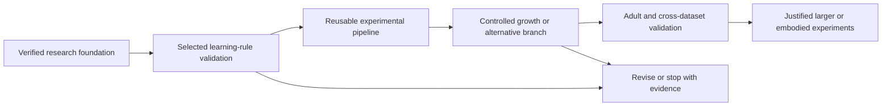

# Neural Scaling of the Drosophila Connectome

**EXP-002 validation implementation • 11 September 2026 • no development or confirmation campaign run.**

We investigate which changes to a Drosophila-derived neural system improve computational or adaptive capabilities, and whether biological organization gives an advantage over suitable alternatives. The foundation contains a dated research synthesis, a 70-source bibliography, source/data audits, competing branches, and three detailed experiment handoffs. A small CPU-only EXP-002 implementation now passes bounded equation, data, toy-learning and episode-state checks. There are no scientific hypothesis results.

Start with the [EXP-002 validation handoff](experiments/EXP-002-validation.md) for commands, measured check results and remaining gates. [STATE_OF_ART.md](STATE_OF_ART.md) and [RESEARCH_BRANCHES.md](RESEARCH_BRANCHES.md) retain the research context. EXP-002 is selected; R02 automated adaptation checks pass, but independent review or author-runtime comparison remains open. [EXP-001: intrinsic capacity](experiments/EXP-001.md) is an independent alternative. [EXP-003: structured growth](experiments/EXP-003.md) requires a validated and scientifically usable learning assay.

## Authoritative records

| Purpose | Record |
|---|---|
| Scientific purpose and working principles | [PROJECT_CHARTER](PROJECT_CHARTER.md) |
| Six-area synthesis and open research map | [STATE_OF_ART](STATE_OF_ART.md) |
| Claim status and counterevidence | [CLAIMS_LEDGER](CLAIMS_LEDGER.md) |
| Data versions, access, filters and limitations | [DATA_PROVENANCE](DATA_PROVENANCE.md) |
| Software commits, licenses, readiness | [SOFTWARE_AUDIT](SOFTWARE_AUDIT.md) |
| Competing hypotheses and ranking | [RESEARCH_BRANCHES](RESEARCH_BRANCHES.md), [NOVEL_IDEAS](NOVEL_IDEAS.md) |
| Experiment status and handoffs | [EXPERIMENTS](EXPERIMENTS.md), [BENCHMARK_SPEC](BENCHMARK_SPEC.md) |
| Published-work validation status | [REPRODUCTIONS](REPRODUCTIONS.md) |
| Failures and null-result attribution | [FAILED_PATHS](FAILED_PATHS.md) |
| Decisions, gaps and next actions | [DECISIONS](DECISIONS.md), [OPEN_QUESTIONS](OPEN_QUESTIONS.md), [ROADMAP](ROADMAP.md) |
| Session continuity | [RESEARCH_LOG](RESEARCH_LOG.md) |
| Source discovery and original-brief audit | [SEARCH_LOG](research/SEARCH_LOG.md), [BRIEF_AUDIT](research/BRIEF_AUDIT.md) |
| Bibliographic database | [Readable bibliography](research/BIBLIOGRAPHY.md), [JSON](research/references.json), [BibTeX](research/references.bib) |

The original [initial prompt](<Initial Research Prompt for Astra — Scaling the Drosophila Connectome.md>) and [master brief](ASTRA_MASTER_RESEARCH_BRIEF.md.md) are preserved unchanged. Their instructions are source material; the user's approved plan governs this work. Original hashes are in the brief audit.

## What is established, and what remains open

The source inspection pinned 11 repository commits and checked small data inputs. It found a real provider-version mismatch, incompatible current simulator dependencies, and indexing/young-cell issues in the larval supplement. These have changed the handoffs. The bibliography records actual read depth; full methods were not available for every source. Some adult export licenses/access details, recent preprint claims and code trees remain unresolved and are explicitly provisional.

The learning/growth handoffs use a 73-mature-KC larval-derived feature circuit with two synthetic output units. The capacity handoff uses a tiny tiled visual graph. Their limits are deliberate: neither directly tests adult whole-brain scaling. A later adult/cross-dataset validation is required before that interpretation.

The intended target is a colleague's PC: user-confirmed 64 GB DDR5 RAM, RTX 5090 with 32 GB VRAM, and Ryzen 7 9800X3D. The user corrected the earlier DDR4 typo; OS, storage and software remain unverified. See the [hardware record](research/target_hardware.json). The user explicitly skipped the measured workstation pilot. Validation checks ran in this session's environment; no target benchmark or runtime estimate has been measured, and no GPU is required for this milestone.

## Session protocol

At start, read this page, ROADMAP, DECISIONS, OPEN_QUESTIONS and the latest RESEARCH_LOG entry. Follow links to the affected claim, branch, source or experiment. At end, update only the authoritative records affected, document substantive changes and record one concrete next action. Never convert a proposed experiment into a historical result or silently replace pinned inputs.

## Audit tools

With Python available, run `python tools/validate_foundation.py` for offline record/link/hash checks. `python tools/inspect_reference_data.py` uses the included source cache, also recoverable by the bounded public download tools. `audit_public_sources.py` and `audit_research_assets.py` require public network access and inspect upstream material without executing it. `refresh_bibliography.py` verifies DOI metadata and regenerates readable/BibTeX views. These are research-record tools, not an experimental platform.

The private repository includes all current project documents, code, research sources in `.cache/research_assets/`, and generated validation artifacts in `results/validation/`. Their original bytes and upstream attribution are preserved; third-party material retains its source terms. Local `.venv` dependencies and Python bytecode are excluded and can be recreated using the validation requirements. The working repository stays in the original project folder.

The optional [collect_target_hardware.ps1](tools/collect_target_hardware.ps1) remains available for a future Windows target. It has not been run on the colleague's PC and is not a prerequisite for these bounded validation checks.

## Foundation acceptance record

| Criterion | Evidence / status |
|---|---|
| Consequential statements traceable or explicitly unresolved |34 claim propositions; semantic recovery of master references; source IDs and read depths |
| Six areas synthesized and competing branches examined | STATE_OF_ART; six branches with counterarguments and inexpensive falsification |
| Dataset/software candidates audited | Pin/access/limits registers;11 commits; small input checks; provisional adult fields visibly unresolved |
| Three implementer handoffs with two distinct approaches | EXP-001/002/003; common statistical/task contract and resource assumptions |
| Work reconstructable across sessions | Canonical records, bibliography, original hashes, audit scripts, local Git |
| Evidence-based progression and stop conditions | ROADMAP and per-experiment decision rules |
| Search stopping condition | Two post-revision targeted rounds without shortlist-changing evidence; scope and gaps documented |

The foundation remains intact. EXP-002 is now in validation, with evidence and limits recorded in the handoff. Next: review the equation adaptation independently or run the prepared author comparison; then implement development-only assay evaluation without a separate workstation pilot.
