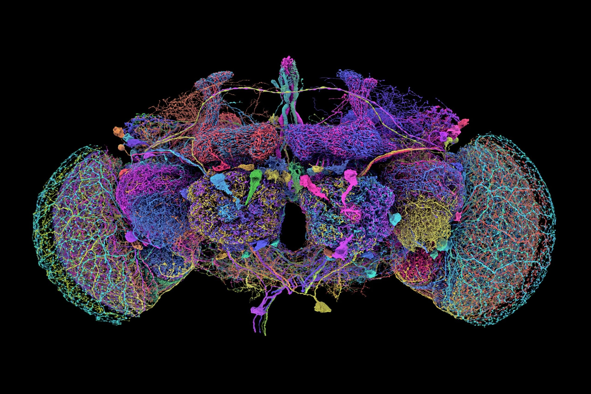

# Neural Scaling of the Drosophila Connectome

**Start with the [academic report: Bounded participation calibration and memory retention](publication/academic_report.pdf).**

Thomas Julsgaard · MSc student in Software Design, IT University of Copenhagen
Report dated 16 September 2026 · Public research release prepared 21 September 2026

<p align="center">
  
  <br>
  <sub>The 50 largest neurons in the adult fruit-fly brain connectome. Credit: Tyler Sloan and Amy Sterling for <a href="https://flywire.ai/for_media">FlyWire</a>, Princeton University (Dorkenwald et al., 2024). Shown for anatomical context; this repository studies bounded derived circuits rather than simulating the whole brain.</sub>
</p>

This repository is the research and reproducibility companion to the report. It contains the experimental code, frozen protocols, development and confirmation records, negative results, source audits, figures and editable manuscripts. The report is the primary scientific account; earlier research directions and session records provide supporting context.

- **[Read the report (PDF, 11 pages)](publication/academic_report.pdf)**
- **[Read the technical supplement (PDF, 6 pages)](publication/technical_supplement.pdf)**
- [Download the compact report package](publication/report_package.zip), including editable sources, figures and evidence summaries.
- [Download the full saved-array evidence](https://github.com/T-Julsgaard/Neural-Scaling-of-the-Drosophila-Connectome/releases/tag/academic-report-2026-09-21) and follow the [reproduction guide](REPRODUCIBILITY.md).

## Scientific scope

The experiments ask how activity, population structure, participation calibration and learning procedures affect memory in bounded Drosophila-derived circuits. The report brings together larval and adult mushroom-body feature circuits, a supplied-model positive control, and frozen-representation diagnostics on associative and nonlinear tasks.

The central findings are deliberately narrow:

- Bounded participation calibration does not establish a general retention advantage over ordinary tuning in the main larval/adult comparisons.
- Information can remain recoverable from frozen features while a sequential readout forgets previously learned associations.
- Task construction, readout class, calibration, learning-rate selection and access to earlier observations materially qualify those results. Random-feature parity and a successful quadratic sequential baseline limit anatomical and mechanism claims.

These are synthetic computational assays, not a whole-brain simulation, biological discovery, demonstrated biological superiority or established neural scaling law. The report has not been independently peer reviewed. Public availability does not imply journal submission or acceptance. Read the [claim audit](publication/claim_audit.md) for the numerical evidence and qualifications.

## Reproduce and inspect

The [reproduction guide](REPRODUCIBILITY.md) separates three tasks: rebuilding the publication, checking the original saved evidence, and replaying experiment computations. The compact publication package can rebuild figures without the multi-gigabyte simulation archive. Full record checks require the saved arrays from the release.

```sh
git clone https://github.com/T-Julsgaard/Neural-Scaling-of-the-Drosophila-Connectome.git
cd Neural-Scaling-of-the-Drosophila-Connectome
python publication/verify_package.py
```

The verification command uses Python's standard library and checks the delivered publication file hashes. See [publication/README.md](publication/README.md) for pinned rendering dependencies and the Windows font requirements. Experiments used CPU computation; a GPU is not required for these bounded assays.

## Repository map

| Material | Location |
|---|---|
| Main report, supplement, editable manuscripts, references, figures and source numbers | [publication/](publication/README.md) |
| Reproduction instructions and complete saved-array release | [REPRODUCIBILITY.md](REPRODUCIBILITY.md) |
| Experiment specifications, protocols and scientific results | [experiments/](experiments), [EXPERIMENTS.md](EXPERIMENTS.md) |
| Simulation implementations and shared modules | [exp002/](exp002), [exp003/](exp003), [exp004/](exp004), [exp005/](exp005), [exp006/](exp006), [exp007/](exp007), [exp008/](exp008), [exp009/](exp009) |
| Experiment runners, analyses, source acquisition and audit tools | [tools/](tools) |
| Implementation checks and reference fixtures | [tests/](tests) |
| Frozen contracts, selections, checkpoints, summaries and source snapshots | [results/](results) plus the release archives |
| Bibliography, source audits, artifact manifests and research records | [research/](research), [bibliography](research/BIBLIOGRAPHY.md) |
| Data and software provenance | [DATA_PROVENANCE.md](DATA_PROVENANCE.md), [SOFTWARE_AUDIT.md](SOFTWARE_AUDIT.md), [attribution](publication/ATTRIBUTION.md) |
| Claims, failed paths and scientific decisions | [CLAIMS_LEDGER.md](CLAIMS_LEDGER.md), [FAILED_PATHS.md](FAILED_PATHS.md), [DECISIONS.md](DECISIONS.md) |
| Research history and future directions | [RESEARCH_HISTORY.md](RESEARCH_HISTORY.md), [RESEARCH_LOG.md](RESEARCH_LOG.md), [ROADMAP.md](ROADMAP.md) |

EXP-001 remains a specification; EXP-002 through EXP-011 have completed scientific records. Historical handoffs and original prompts are preserved for traceability; their dated instructions are not current release instructions.

## Evidence and limitations

The report-production records document 43 paired-summary checks, 380 saved-array/summary checks, and the schema-3 repository validator. The compact package also records a figure rebuild from its bundled evidence. These are automated self-audit and production checks, not independent scientific replication. Exact inputs, seeds, frozen selections, confidence levels, exclusions and source hashes are retained in the experiment records and supplement.

The Git repository includes compact results and frozen source material. Larger original NPZ arrays are distributed as checksummed release assets; restoring them recreates their original `results/` paths. Installed environments, Octave binaries, rendering intermediates and personal editor/cache settings are excluded. Historical scientific execution records may contain original machine paths and runtime details; these document provenance and are not installation requirements.

## Citation and rights

Please cite the report as:

> Julsgaard, Thomas. (2026). *Bounded participation calibration and memory retention*. Academic report, 16 September 2026. Neural Scaling of the Drosophila Connectome research repository.

[CITATION.cff](CITATION.cff) supplies machine-readable citation metadata. Also cite the relevant upstream data and model papers when using their material; details and pinned versions are in [ATTRIBUTION.md](publication/ATTRIBUTION.md) and the report bibliography. No DOI is assigned to this release.

[RIGHTS.md](RIGHTS.md) explains the rights boundary. Public access is not a blanket license for all contents: upstream code and data retain their own terms, and no new project-wide license is asserted.
