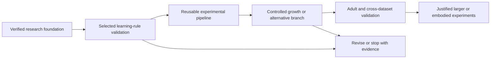

# Neural Scaling of the Drosophila Connectome

## Current decision — Session D complete, 2026-09-16

The [report content and attribution review](research/REPORT_CONTENT_AND_ATTRIBUTION.md) now identifies the findings that belong in the main text and the exact data/code/model dependencies to cite. The local draft includes these attribution corrections.

The evidence supports a **narrow empirical report**, not a new mechanism, biological discovery or scaling law. B/C's recoverability prediction passes, but remains familiar and does not causally explain the earlier compensation nulls. C's calibration benefit, random-feature parity, quadratic sequential success and rate-grid boundary remain material qualifications. Read the [D assessment and claim table](research/SESSION_D_ASSESSMENT.md), [local report draft](research/EMPIRICAL_REPORT_DRAFT.md), [figure plan](research/SESSION_D_FIGURE_PLAN.md) and [primary-literature audit](research/SESSION_D_LITERATURE_AUDIT.md).

Next: scientific review and figure/reproducibility preparation if pursued; no further campaign is necessary for the restricted claims. No publication, submission or push. This status supersedes all dated “D not started,” B/C deferral and next-session instructions below, which remain historical records.

## Current Session C status — 2026-09-15

The prospective prediction is supported: useful nonlinear distinctions remain readable from frozen sparse representations while the tuned sequential readout loses previously learned associations. Native/calibrated offline old-context accuracy 95.67 [92.91, 98.44]%; tuned sequential accuracy 51.73 [41.24, 62.21]%; paired gap 43.95 [34.23, 53.67] pp; acquisition-to-final loss 45.86 [35.78, 55.93] pp (95% intervals, 24 fresh blocks). [EXP-011 report](experiments/EXP-011-results.md). C is complete; D has not started. Current user authorization supersedes the historical C deferral below. Next action only when requested: D per [handoff](research/SESSION_D_HANDOFF.md). No publication.

## Current Session B status — 2026-09-15

Offline full-outcome old-pair accuracy 96.97% versus fully supervised online 76.72%; paired difference 20.26 pp [16.46, 24.05] (95%, 24 fresh task blocks, native/calibrated average). Frozen-feature information remains linearly recoverable despite sequential readout forgetting in this fixed larval assay. Offline is an explanatory diagnostic with different fitting/history access, not an equal-budget competitor or capacity bound. Five validation tests; six development tasks; all 31 validation/development/confirmation blocks replayed. B gate passed; C is explicitly deferred by the user. [EXP-010 report](experiments/EXP-010-results.md). The next scientific question is transfer beyond this associative assay; new seeds here are not task-family transfer.

**Session A complete — EXP-009 audited, 15 September 2026.** The bounded author-parameter positive control passed its gate: compensation improves correct-valence choice probability by 8.58 pp [8.13, 9.03] (95% paired task-block interval). This is a fresh-task adaptation conditional on one supplied author model, not exact Figure 4 reproduction. [Final report](experiments/EXP-009-results.md). **Next: Session B's representation-versus-learning diagnostic**, following [the saved handoff](research/SESSION_B_HANDOFF.md). Session B has not started; its gate-dependent sequence supersedes the older immediate-next-action wording below.

**Priority 4 complete — EXP-008 audited.** Adult calibration minus ordinary tuning: -0.19 [-1.01, 0.68] pp (98.333333% interval). Transfer classification: equivalent; informative-benchmark gate passed. [EXP-008 results](experiments/EXP-008-results.md). Its earlier task-family handoff is now sequenced after Session B's diagnostic. Growth, collision-targeted rewiring and evolution retain their explicit entry conditions.

**EXP-002 through EXP-008 complete and audited • 14 September 2026.**

[EXP-006 persistent-memory results](experiments/EXP-006-results.md): 32 confirmation blocks audited. At 16 similar pairs, native K6 retains 78.74% versus K4 71.14% (+7.60 pp [4.68,10.43], primary 98.75%). Initial learning stays high while old memories deteriorate. K6 passes the average-capacity criterion through 8 pairs; direct input through 16 with fewer learned weights. Individual memory losses remain severe. The resulting participation test is now complete in EXP-007; growth stays conditional.

[EXP-005 mechanism results](experiments/EXP-005-results.md): K6 retains a +3.78 pp advantage [2.39,5.27] after matched updates and equal tuning (primary 98.75%). New learning does not show a compensating deficit. More repeatable noisy-cue responses and broader participation are candidate contributors; unique mediation is unresolved. The subsequent [persistent-memory benchmark](experiments/EXP-006-results.md) is now complete, including direct-input and randomized sparse baselines.

EXP-004 completed and audited: 32 fresh evaluation blocks, 17,920 episodes and 47 passed preflight tests. Under the fixed 32-feature readout, increasing normalized active count K4→K6 improves retention +5.37 pp [3.89,6.97], while population growth N73→N110 reduces it -5.03 pp [-7.27,-2.86] (primary 98.333333% intervals). See the [EXP-004 report and figure](experiments/EXP-004-results.md). The tested activity change helps retention; the population intervention does not provide an independent benefit in this assay.

We investigate which changes to a Drosophila-derived neural system improve computational or adaptive capabilities, and whether biological organization gives an advantage over suitable alternatives. The foundation contains a dated research synthesis, a 70-source bibliography, source/data audits, competing branches, and three detailed experiment handoffs. EXP-002 now has a validated, measured CPU learning baseline. The development-selected generic delta learner reached 0.975 acquisition, 0.743 early reversal and 0.916 post-interference retention probability on held-out tasks; chance is 0.5. The assay passes its readiness criterion for structural experiments. These are narrow synthetic-task results, not whole-brain or biological-superiority findings.

The long-term ambition is a more capable, reproducible digital nervous system that can be shared for scientific study. Following mission review (D021), ancestry-preserving evolution is an integrated exploratory branch. The selected route is validated learning, controlled structural interventions, then a bounded lineage pilot if its prerequisites pass. [ROADMAP.md](ROADMAP.md) specifies that entry point and preserves alternative approaches; no evolutionary search has been implemented or run.

Start with [EXP-008 results](experiments/EXP-008-results.md). Priorities 1–4 are complete. Priority 4 completed: [EXP-008 results](experiments/EXP-008-results.md). Next: define a distinct held-out task family to test the limitation beyond this associative assay. Growth, collision-targeted rewiring and evolution retain their explicit entry conditions; no additional campaign is launched.

## Authoritative records

| Purpose | Record |
|---|---|
| Scientific purpose and working principles | [PROJECT_CHARTER](PROJECT_CHARTER.md) |
| Six-area synthesis and open research map | [STATE_OF_ART](STATE_OF_ART.md) |
| Claim status and counterevidence | [CLAIMS_LEDGER](CLAIMS_LEDGER.md) |
| Data versions, access, filters and limitations | [DATA_PROVENANCE](DATA_PROVENANCE.md) |
| Software commits, licenses, readiness | [SOFTWARE_AUDIT](SOFTWARE_AUDIT.md) |
| Competing hypotheses and ranking | [RESEARCH_BRANCHES](RESEARCH_BRANCHES.md), [NOVEL_IDEAS](NOVEL_IDEAS.md) |
| Experiment status and handoffs | [EXPERIMENTS](EXPERIMENTS.md), [BENCHMARK_SPEC](BENCHMARK_SPEC.md) |
| Published-work validation status | [REPRODUCTIONS](REPRODUCTIONS.md) |
| Failures and null-result attribution | [FAILED_PATHS](FAILED_PATHS.md) |
| Decisions, gaps and next actions | [DECISIONS](DECISIONS.md), [OPEN_QUESTIONS](OPEN_QUESTIONS.md), [ROADMAP](ROADMAP.md) |
| Session continuity | [RESEARCH_LOG](RESEARCH_LOG.md) |
| Source discovery and original-brief audit | [SEARCH_LOG](research/SEARCH_LOG.md), [BRIEF_AUDIT](research/BRIEF_AUDIT.md) |
| Bibliographic database | [Readable bibliography](research/BIBLIOGRAPHY.md), [JSON](research/references.json), [BibTeX](research/references.bib) |

The original [initial prompt](<Initial Research Prompt for Astra — Scaling the Drosophila Connectome.md>) and [master brief](ASTRA_MASTER_RESEARCH_BRIEF.md.md) are preserved unchanged. Their instructions are source material; the user's approved plan governs this work. Original hashes are in the brief audit.

## What is established, and what remains open

The source inspection pinned 11 repository commits and checked small data inputs. It found a real provider-version mismatch, incompatible current simulator dependencies, and indexing/young-cell issues in the larval supplement. These have changed the handoffs. The bibliography records actual read depth; full methods were not available for every source. Some adult export licenses/access details, recent preprint claims and code trees remain unresolved and are explicitly provisional.

The learning/growth handoffs use a 73-mature-KC larval-derived feature circuit with two synthetic output units. The capacity handoff uses a tiny tiled visual graph. Their limits are deliberate: neither directly tests adult whole-brain scaling. A later adult/cross-dataset validation is required before that interpretation.

The intended target is a colleague's PC: user-confirmed 64 GB DDR5 RAM, RTX 5090 with 32 GB VRAM, and Ryzen 7 9800X3D. OS, storage and software remain unverified. See the [hardware record](research/target_hardware.json). The separate workstation pilot remains skipped. The baseline ran on this session's CPU, with 89.49 seconds development and 162.83 seconds confirmation active episode time and peak working set below 88 MiB. These are current-session measurements, not timings for the colleague's PC; batched configurations do not establish per-rule runtime rankings.

## Session protocol

At start, read this page, ROADMAP, DECISIONS, OPEN_QUESTIONS and the latest RESEARCH_LOG entry. Follow links to the affected claim, branch, source or experiment. At end, update only the authoritative records affected, document substantive changes and record one concrete next action. Never convert a proposed experiment into a historical result or silently replace pinned inputs.

## Audit tools

With Python available, run `python tools/validate_foundation.py` for offline record/link/hash checks. `python tools/inspect_reference_data.py` uses the included source cache, also recoverable by the bounded public download tools. `audit_public_sources.py` and `audit_research_assets.py` require public network access and inspect upstream material without executing it. `refresh_bibliography.py` verifies DOI metadata and regenerates readable/BibTeX views. These are research-record tools, not an experimental platform.

The private repository contains the research foundation and prior validation snapshot. New local baseline work includes code, reports, frozen contracts, compact checkpoints and figures under `results/exp002_baseline/`; per-trial NPZ artifacts remain locally retained and Git-ignored, with hashes in the run record. The portable Octave and plotting runtimes are also ignored caches. Original source bytes and upstream attribution are preserved; third-party material retains its source terms. The working repository stays in the original project folder. This baseline session does not itself commit or push the new files.

The optional [collect_target_hardware.ps1](tools/collect_target_hardware.ps1) remains available for a future Windows target. It has not been run on the colleague's PC and is not a prerequisite for these bounded validation checks.

## Foundation acceptance record

| Criterion | Evidence / status |
|---|---|
| Consequential statements traceable or explicitly unresolved |34 claim propositions; semantic recovery of master references; source IDs and read depths |
| Six areas synthesized and competing branches examined | STATE_OF_ART; six branches with counterarguments and inexpensive falsification |
| Dataset/software candidates audited | Pin/access/limits registers;11 commits; small input checks; provisional adult fields visibly unresolved |
| Three implementer handoffs with two distinct approaches | EXP-001/002/003; common statistical/task contract and resource assumptions |
| Work reconstructable across sessions | Canonical records, bibliography, original hashes, audit scripts, local Git |
| Evidence-based progression and stop conditions | ROADMAP and per-experiment decision rules |
| Search stopping condition | Two post-revision targeted rounds without shortlist-changing evidence; scope and gaps documented |

The historical foundation and EXP-002/003/004 evidence remain intact. EXP-005 completed the bounded N73 mechanism milestone and EXP-006 completed persistent-memory load and similarity. Participation and adult cross-circuit validation are complete; task-family generalization remains open.
