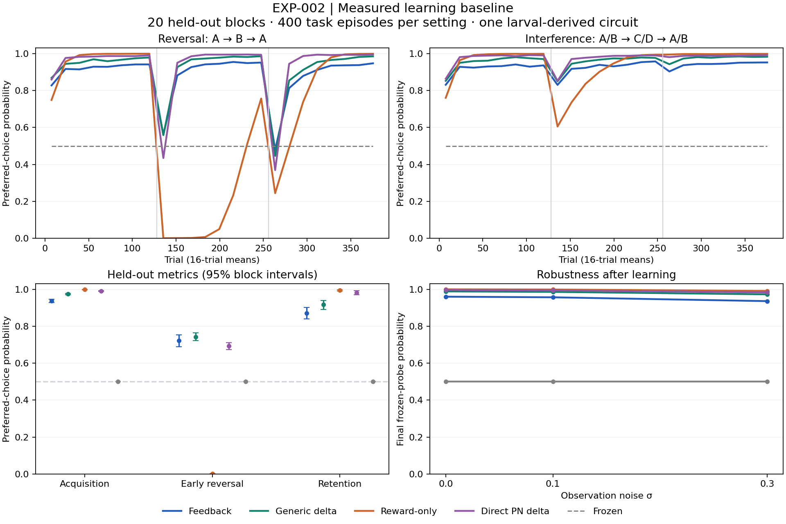

# EXP-002 — Measured learning baseline

Completed 2026-09-11T22:06:47.447411+00:00 (UTC). Protocol 1.1. Ten development blocks and twenty independent confirmation task blocks completed. No episodes excluded; no numerical failures recorded.

## Validation

R02 passed by actual GNU Octave 11.3.0 execution of the source-preserving author fixture: maximum difference 6.66e-16 across 256 updates, tolerance 1e-10. This validates the isolated learning rule, not the paper's biological findings. The full 21-test implementation suite passed, including batched/scalar trajectories, probes, data separation and recovery.

## Held-out results

Values are mean preferred-choice probabilities with 95% block-bootstrap intervals. Chance is 0.5. Acquisition averages both families; early reversal uses reversal episodes; retention probes A/B after C/D interference, before return training.

| Learner | Acquisition | Early reversal | Retention after interference | Robustness σ=0.3 |
|---|---:|---:|---:|---:|
| Feedback | 0.937 [0.928, 0.946] | 0.721 [0.690, 0.753] | 0.870 [0.839, 0.901] | 0.936 [0.926, 0.946] |
| Generic delta | 0.975 [0.972, 0.978] | 0.743 [0.722, 0.765] | 0.916 [0.891, 0.939] | 0.973 [0.966, 0.979] |
| Reward-only | 0.999 [0.998, 1.000] | 0.001 [0.000, 0.001] | 0.995 [0.991, 0.998] | 0.991 [0.989, 0.994] |
| Direct PN delta | 0.990 [0.987, 0.992] | 0.693 [0.673, 0.712] | 0.982 [0.970, 0.992] | 0.983 [0.980, 0.986] |
| Frozen | 0.500 [0.500, 0.500] | 0.500 [0.500, 0.500] | 0.500 [0.500, 0.500] | 0.500 [0.500, 0.500] |

Primary feedback minus reward-only reversal difference: **0.7207**, 98.33% interval [0.6819, 0.7593], practical minimum +0.05. H2 status: **supported**.

Feedback minus generic-delta reversal: -0.0214, 95% interval [-0.0560, 0.0141]. Equivalence within ±0.02 established: **False**. Feedback acquisition noninferiority to reward-only established: **False**.

The development-selected candidate for structural work is `native_delta_eta0.01_T0.1`. Its held-out assay adequacy gate passes: **True**. This gate requires acquisition lower interval >0.65 and remaining headroom in reversal or retention; it does not establish a biological wiring advantage.



## Frozen settings and diagnostics

| Learner | Learning rate | Temperature | Development selection score |
|---|---:|---:|---:|
| Feedback | 0.01 | 0.2 | 0.8424 |
| Generic delta | 0.01 | 0.1 | 0.8702 |
| Reward-only | 0.001 | 0.1 | 0.6625 |
| Direct PN delta | 0.01 | 0.1 | 0.8907 |
| Frozen | 0 | 0.2 | 0.5000 |

Prespecified fixed-setting sensitivity (eta=0.001, T=0.2; secondary, separate from the tuned primary contrast):

| Learner | Acquisition | Early reversal | Retention |
|---|---:|---:|---:|
| Feedback | 0.974 [0.972, 0.976] | 0.417 [0.396, 0.440] | 0.938 [0.927, 0.948] |
| Generic delta | 0.961 [0.958, 0.963] | 0.266 [0.250, 0.283] | 0.932 [0.923, 0.941] |
| Reward-only | 0.997 [0.996, 0.998] | 0.004 [0.002, 0.005] | 0.991 [0.987, 0.995] |

Feedback: retention change -0.075 [-0.096, -0.055]; both DAN drives positive on 67.6% of steps; inclusive rate-match regime 68.0%.

Generic delta: retention change -0.061 [-0.082, -0.041]; both DAN drives positive on 70.1% of steps; inclusive rate-match regime 70.5%.

Reward-only: retention change -0.004 [-0.008, -0.001]; both DAN drives positive on 40.3% of steps; inclusive rate-match regime 41.0%.

Native feature covariance participation rank: mean 18.18, block range 16.74–19.34. Never-active cell fraction: mean 38.8%. This is inactivity under these synthetic cues and the winner-selection encoder, not evidence of biologically inactive neurons. Full per-cell participation is retained in the machine-readable report.

The feedback rule improves reversal over reward-only learning but loses acquisition and retention performance. Generic delta was selected on development data for structural follow-up; confirmation does not establish feedback/delta equivalence or a uniquely biological learning advantage. The direct-PN comparator trades slower early reversal for stronger retention. Preserve these tradeoffs when testing growth.

## Measured resources

Measurements describe this session's CPU execution, not the colleague's PC. Configurations were batched; timings cannot rank per-rule efficiency. Active wall time excludes session pauses and includes episode preprocessing, learning, probes and artifact writes.

| Stage | Configurations | Learning updates | Active wall seconds | CPU seconds | Peak working set MiB |
|---|---:|---:|---:|---:|---:|
| development | 37 | 2,764,800 | 89.49 | 80.64 | 87.7 |
| confirmation | 8 | 1,075,200 | 162.83 | 142.02 | 51.8 |

## Reproduce and inspect

With NumPy 2.3.5 and the validated author runtime evidence available, use a fresh output directory to reproduce a campaign. Existing output directories enforce frozen code/environment/input hashes.

```powershell
python tools/validate_baseline.py
python tools/run_baseline.py development --output results/exp002_baseline_reproduction/development
python tools/run_baseline.py confirmation --output results/exp002_baseline_reproduction/confirmation --selection results/exp002_baseline_reproduction/development/selection.json
python tools/report_baseline.py --root results/exp002_baseline_reproduction
```

To resume an interrupted stage, repeat its run command without changing code, dependencies, gate reports or settings. Regenerating validation reports changes their hashes; use a fresh output directory after doing so. Reproduction output is separate from the original frozen run. The original gate reports are retained under `validation_evidence/`.

Plotting requires Matplotlib 3.10.7; the numerical campaign requires only the pinned NumPy runtime. Full local per-trial artifacts, checkpoints, frozen contracts, selected settings and block reports are under `results/exp002_baseline/`. Compact evidence and integrity manifests are retained with the research record. All original source bytes and the two original briefs are preserved.

## Limits

This is a feedforward 40-input/73-feature larval-derived representation with two synthetic outputs. The direct-PN comparator has fewer weights and a different representation; it is exploratory, not parameter matched. These results establish within-family learning and adaptation on synthetic cue tasks. They do not show whole-brain function, broader intelligence, an advantage of biological wiring, or any benefit from growth/evolution. Intervals quantify task-block variation from one reference circuit, not independent animal variation.
