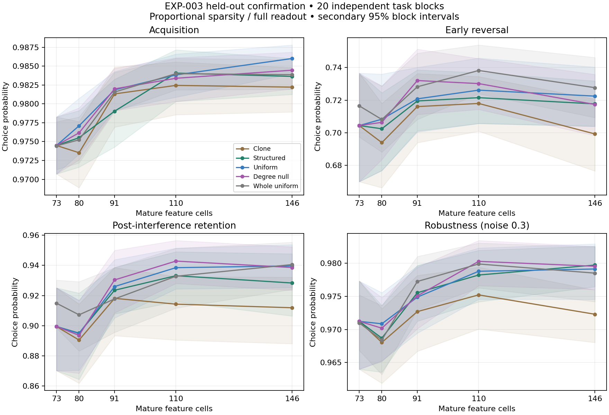

# EXP-003 held-out confirmation results

2026-09-12. **All twenty untouched confirmation blocks completed and audited.**

Generic delta; frozen eta=0.01, temperature=0.1. Three graph replicates are averaged within each task block. Native N73 is reused once per block. No confirmation selection or sample-budget change.

[Frozen protocol](EXP-003-confirmation-protocol.md), [preflight](../research/exp003_confirmation_validation.json), [audited run](../research/runs/EXP-003-confirmation.json), [all block values, metrics and curves](../results/exp003_confirmation/analysis.json).

## Primary organization test

Structured minus degree-null early reversal at N110, proportional sparsity/full readout: **-0.009 [-0.023, +0.007]**, 98.33% interval. Planned practical minimum: **+0.050**.

The upper interval is below +0.05: evidence against the planned practically useful wiring advantage in this assay. Deprioritize this structured prior.

## Post-audit interpretation and next milestone

The work is fruitful, but the supported effect is narrower than a general adaptation gain. Structured N110 minus N73 retention is **+0.034 [+0.017, +0.053]**, with acquisition **+0.010 [+0.006, +0.013]** and robustness at noise .3 **+0.007 [+0.002, +0.014]**. These are secondary 95% intervals. Early reversal is **+0.017 [-0.012, +0.048]**: its interval includes no improvement, so the development reversal signal did not become a clear held-out result. Uniform and degree-null growth have similar or larger retention gains. The exploratory whole-uniform N110 arm improves reversal relative to its own resampled N73 base, but it does not replace the declared primary comparison.

The retention gain survives the fixed 32-feature readout: **+0.045 [+0.018, +0.073]**, despite 64 trainable weights at both sizes. It disappears under fixed-four activity: **-0.020 [-0.042, +0.005]**. Thus increasing output-weight count alone cannot account for all the retention evidence, while sparsity/active-unit count materially conditions it. This is not proof that active-unit count alone causes the gain: representation, winner competition and activity per selected cell also interact.

Deprioritize the conditioned wiring prior's planned +.05 advantage. Preserve the modest, sparsity-dependent retention/robustness result and the uncertain reversal effects. The protocol's rationale for immediate adult transfer is not fully met because a useful reversal gain across the main growth arms remains unresolved. The next concrete milestone is a **prospective active-count-versus-population diagnostic**, varying active count at fixed population size and population size at fixed active count, retaining full/fixed readouts and using fresh validation/development and untouched evaluation streams. Include an information/precision and resource calculation before choosing a new sample budget; do not extend or retune these completed confirmation blocks. Richer-task/adult transfer and the bounded B5 lineage pilot remain subsequent design options, not completed or newly executed experiments.

## Held-out profiles

Full readout and proportional sparsity. Means of block means; units are probabilities.

| Rule | Cells | Acquisition | Early reversal | Retention | Robustness 0.3 |
|---|---:|---:|---:|---:|---:|
| Native baseline | 73 | 0.974 | 0.704 | 0.899 | 0.971 |
| Clone | 80 | 0.974 | 0.694 | 0.890 | 0.968 |
| Clone | 91 | 0.981 | 0.716 | 0.918 | 0.973 |
| Clone | 110 | 0.982 | 0.718 | 0.914 | 0.975 |
| Clone | 146 | 0.982 | 0.699 | 0.912 | 0.972 |
| Structured | 80 | 0.976 | 0.702 | 0.895 | 0.969 |
| Structured | 91 | 0.979 | 0.720 | 0.924 | 0.976 |
| Structured | 110 | 0.984 | 0.722 | 0.933 | 0.978 |
| Structured | 146 | 0.984 | 0.718 | 0.928 | 0.980 |
| Uniform | 80 | 0.977 | 0.708 | 0.895 | 0.971 |
| Uniform | 91 | 0.982 | 0.721 | 0.926 | 0.975 |
| Uniform | 110 | 0.984 | 0.726 | 0.938 | 0.979 |
| Uniform | 146 | 0.986 | 0.722 | 0.940 | 0.979 |
| Degree null | 80 | 0.976 | 0.706 | 0.894 | 0.970 |
| Degree null | 91 | 0.982 | 0.732 | 0.930 | 0.975 |
| Degree null | 110 | 0.983 | 0.730 | 0.943 | 0.980 |
| Degree null | 146 | 0.984 | 0.717 | 0.939 | 0.980 |
| Whole uniform | 73 | 0.974 | 0.717 | 0.915 | 0.971 |
| Whole uniform | 80 | 0.975 | 0.708 | 0.907 | 0.968 |
| Whole uniform | 91 | 0.982 | 0.728 | 0.918 | 0.977 |
| Whole uniform | 110 | 0.984 | 0.738 | 0.933 | 0.980 |
| Whole uniform | 146 | 0.984 | 0.728 | 0.941 | 0.979 |

## Secondary scale changes

Paired change versus each matching N73 baseline; **secondary exploratory 95% intervals**, not additional primary tests. Scale was not promoted to a primary hypothesis after development.

| Rule / cells | Early reversal | Retention | Acquisition | Robustness 0.3 | Acquisition lower bound > −.02 |
|---|---|---|---|---|---|
| Clone / 110 | +0.014 [-0.012, +0.039] | +0.015 [-0.002, +0.033] | +0.008 [+0.005, +0.011] | +0.004 [-0.002, +0.011] | True |
| Clone / 146 | -0.005 [-0.031, +0.019] | +0.012 [-0.004, +0.030] | +0.008 [+0.004, +0.011] | +0.001 [-0.004, +0.008] | True |
| Structured / 110 | +0.017 [-0.012, +0.048] | +0.034 [+0.017, +0.053] | +0.010 [+0.006, +0.013] | +0.007 [+0.002, +0.014] | True |
| Structured / 146 | +0.013 [-0.013, +0.041] | +0.029 [+0.009, +0.050] | +0.009 [+0.006, +0.012] | +0.009 [+0.004, +0.014] | True |
| Uniform / 110 | +0.022 [-0.004, +0.047] | +0.039 [+0.019, +0.061] | +0.009 [+0.006, +0.012] | +0.008 [+0.002, +0.015] | True |
| Uniform / 146 | +0.018 [-0.009, +0.045] | +0.040 [+0.019, +0.064] | +0.012 [+0.009, +0.014] | +0.008 [+0.002, +0.015] | True |
| Degree null / 110 | +0.026 [-0.000, +0.051] | +0.043 [+0.026, +0.064] | +0.009 [+0.005, +0.013] | +0.009 [+0.004, +0.015] | True |
| Degree null / 146 | +0.013 [-0.014, +0.040] | +0.039 [+0.020, +0.060] | +0.010 [+0.007, +0.013] | +0.008 [+0.003, +0.015] | True |
| Whole uniform / 110 | +0.022 [+0.006, +0.037] | +0.018 [+0.006, +0.029] | +0.010 [+0.007, +0.012] | +0.009 [+0.006, +0.012] | True |
| Whole uniform / 146 | +0.011 [-0.004, +0.027] | +0.026 [+0.012, +0.038] | +0.009 [+0.007, +0.012] | +0.008 [+0.004, +0.011] | True |

## Sparsity and readout controls

Every change compares N110 with its own matching N73 control. Bottleneck readout: 64 trainable weights at both sizes. Intervals are secondary 95%.

| Control | Rule | Early reversal | Retention | Acquisition | Robustness 0.3 |
|---|---|---|---|---|---|
| fixed4 | Clone | -0.021 [-0.045, +0.002] | -0.032 [-0.050, -0.014] | -0.008 [-0.012, -0.004] | -0.012 [-0.019, -0.004] |
| fixed4 | Structured | -0.008 [-0.035, +0.018] | -0.020 [-0.042, +0.005] | -0.003 [-0.007, +0.000] | -0.005 [-0.012, +0.002] |
| fixed4 | Degree null | -0.021 [-0.049, +0.007] | -0.007 [-0.026, +0.014] | -0.002 [-0.005, +0.002] | -0.003 [-0.011, +0.006] |
| bottleneck | Structured | +0.016 [-0.020, +0.053] | +0.045 [+0.018, +0.073] | +0.013 [+0.009, +0.017] | +0.007 [-0.002, +0.018] |
| bottleneck | Degree null | +0.035 [+0.005, +0.068] | +0.055 [+0.024, +0.085] | +0.011 [+0.006, +0.016] | +0.008 [-0.002, +0.018] |

| Structured minus degree null at N110 | Early reversal | Retention |
|---|---|---|
| full | -0.009 [-0.021, +0.004] | -0.010 [-0.019, +0.000] |
| fixed4 | +0.012 [-0.003, +0.028] | -0.012 [-0.029, +0.004] |
| bottleneck | -0.020 [-0.037, -0.002] | -0.010 [-0.040, +0.018] |

## Feature participation

| Rule at N110 | Added cells unused | Cell covariance participation rank |
|---|---:|---:|
| Clone | 36.5% | 17.32 |
| Structured | 31.8% | 20.56 |
| Uniform | 29.2% | 21.16 |
| Degree null | 31.0% | 20.65 |

Unused means never activated by presented synthetic cues, not biologically inactive. Full analysis includes pre/post-interference retention, return adaptation, all noise probes, learning curves, resource dimensions and cell/readout diagnostics.

## Execution and limits

All 40 preflight tests passed. Audited 1,600 representation conditions, 32,000 reset episode batches and 32,400 configuration-episodes. No excluded episodes or numerical failures. Frozen native controls stayed exactly at chance; graphs were independently regenerated and every raw episode hash and condition summary verified.

Current-session invocation wall time: 2149.5 seconds with 3 CPU workers. Summed worker episode CPU time: 3986.9 seconds. Maximum individual worker peak memory: 142.5 MiB (not total concurrent RAM). Retained campaign bytes before final report: 669.4 MiB. No energy measurement or colleague-workstation benchmark.

The uncertainty unit is twenty task blocks sharing one fixed anatomical source. Bootstrap intervals are approximate. Scale and controls are secondary exploratory comparisons; held-out cue identities remain within the same synthetic task families. No adult circuit, general cognition, biological superiority or evolutionary-search success follows automatically. Any next experiment needs its own prospective design and untouched evaluation.
