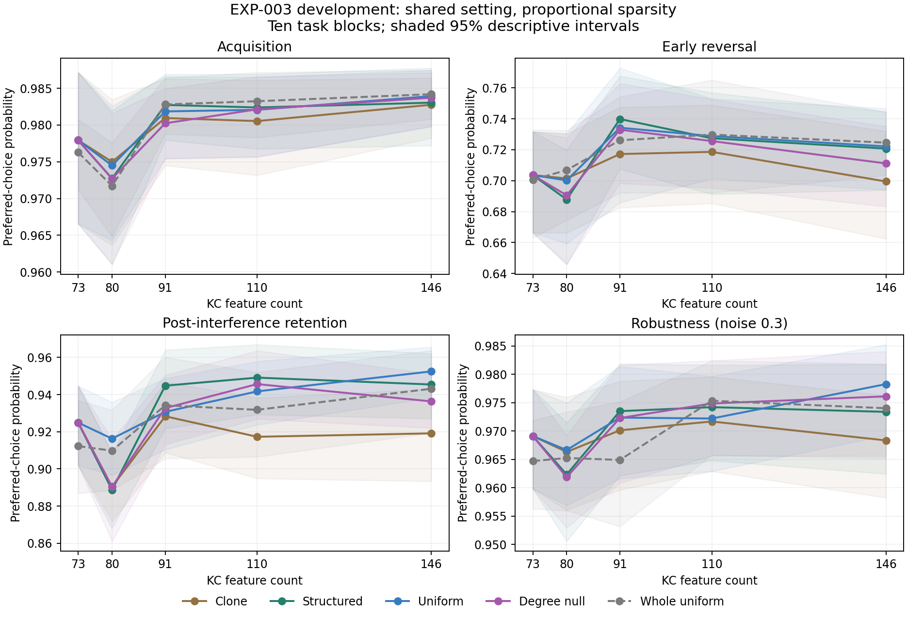

# EXP-003 fresh development results

2026-09-12. **Ten development blocks completed; confirmation has not run.**

The frozen selection rule chose **eta=0.01, temperature=0.1** for generic delta, shared across main growth rules and sizes. The same blocks selected the setting and generated the comparisons below, so intervals are descriptive rather than confirmatory.

[Frozen protocol](EXP-003-development-protocol.md), [validation evidence](../research/exp003_development_validation.json), [run audit](../research/runs/EXP-003-development.json), [complete profiles and contrasts](../results/exp003_development/analysis.json).

## Selected-setting profiles

Means across ten independent task blocks after averaging three nested graph replicates. Native N=73 is reused once per block. Main curves use proportional sparsity and full readouts. All values below are probabilities.

| Rule | Cells | Acquisition | Early reversal | Retention | Robustness 0.3 |
|---|---:|---:|---:|---:|---:|
| Native baseline | 73 | 0.978 | 0.704 | 0.925 | 0.969 |
| Whole uniform | 73 | 0.976 | 0.701 | 0.912 | 0.965 |
| Clone | 110 | 0.981 | 0.719 | 0.917 | 0.972 |
| Structured | 110 | 0.982 | 0.727 | 0.949 | 0.974 |
| Uniform | 110 | 0.982 | 0.729 | 0.942 | 0.972 |
| Degree null | 110 | 0.982 | 0.726 | 0.946 | 0.975 |
| Whole uniform | 110 | 0.983 | 0.730 | 0.932 | 0.975 |
| Clone | 146 | 0.983 | 0.699 | 0.919 | 0.968 |
| Structured | 146 | 0.983 | 0.721 | 0.945 | 0.973 |
| Uniform | 146 | 0.984 | 0.722 | 0.952 | 0.978 |
| Degree null | 146 | 0.984 | 0.711 | 0.936 | 0.976 |
| Whole uniform | 146 | 0.984 | 0.725 | 0.943 | 0.974 |

## Paired changes

Change from each arm's 73-cell baseline; values in brackets are descriptive 95% block intervals.

| Rule / size | Early reversal change | Retention change | Acquisition change |
|---|---|---|---|
| Clone / 110 | +0.015 [-0.006, +0.039] | -0.008 [-0.023, +0.009] | +0.003 [-0.003, +0.010] |
| Clone / 146 | -0.004 [-0.022, +0.015] | -0.006 [-0.024, +0.011] | +0.005 [-0.002, +0.013] |
| Structured / 110 | +0.024 [+0.007, +0.040] | +0.024 [+0.011, +0.038] | +0.004 [-0.003, +0.013] |
| Structured / 146 | +0.017 [+0.001, +0.035] | +0.021 [+0.004, +0.037] | +0.005 [-0.001, +0.012] |
| Uniform / 110 | +0.025 [+0.011, +0.040] | +0.017 [+0.001, +0.033] | +0.004 [-0.001, +0.010] |
| Uniform / 146 | +0.019 [+0.002, +0.036] | +0.028 [+0.009, +0.044] | +0.006 [-0.001, +0.014] |
| Degree null / 110 | +0.022 [+0.001, +0.044] | +0.021 [-0.002, +0.042] | +0.004 [-0.002, +0.011] |
| Degree null / 146 | +0.008 [-0.015, +0.031] | +0.011 [-0.006, +0.029] | +0.006 [-0.002, +0.016] |

## Sparsity and readout controls

The selected shared setting is also used here. Each change compares 110 with its own matching 73-cell control; the bottleneck has 64 trainable output weights at both sizes.

| Control | Rule | Early reversal change | Retention change |
|---|---|---|---|
| fixed4 | Clone | -0.039 [-0.073, -0.007] | -0.079 [-0.113, -0.045] |
| fixed4 | Structured | -0.015 [-0.044, +0.009] | -0.060 [-0.089, -0.027] |
| fixed4 | Degree null | -0.025 [-0.063, +0.009] | -0.054 [-0.081, -0.028] |
| bottleneck | Structured | +0.008 [-0.024, +0.042] | +0.069 [+0.007, +0.137] |
| bottleneck | Degree null | -0.020 [-0.052, +0.010] | +0.055 [+0.002, +0.108] |

Structured minus degree-null early reversal at 110 cells: **+0.002 [-0.014, +0.019]**. The confirmatory practical margin remains +0.05 and its 98.33% test is unrun.

## Feature participation and selection

| Rule at 110 cells | Added cells unused | Cell covariance participation rank |
|---|---:|---:|
| Clone | 37.1% | 17.20 |
| Structured | 32.8% | 20.52 |
| Uniform | 31.5% | 21.25 |
| Degree null | 30.5% | 20.22 |

Unused cells refer to both presented cues under this synthetic encoder, not biologically inactive neurons. More feature diversity does not necessarily improve learning. The complete artifact reports native/added participation, readout ranks, edges, contact counts and output weights.

| Learning rate | Temperature | Equal-weight development score |
|---:|---:|---:|
| 0.0001 | 0.1 | 0.608928 |
| 0.0001 | 0.2 | 0.567574 |
| 0.0001 | 0.5 | 0.529240 |
| 0.001 | 0.1 | 0.717440 |
| 0.001 | 0.2 | 0.694196 |
| 0.001 | 0.5 | 0.640357 |
| 0.01 | 0.1 | 0.873249 |
| 0.01 | 0.2 | 0.854543 |
| 0.01 | 0.5 | 0.789869 |

Each size/arm combination receives equal weight, including the reused native baseline. Whole-uniform, fixed-four and bottleneck results do not enter selection. Fixed EXP-002 eta=.01/T=.1 sensitivity results are retained under `fixed_EXP002` in the analysis artifact, including paired changes and learning curves.

## Execution and limits

All 36 preflight tests passed. The run completed 800 representation conditions, 16,000 reset episode batches and 144,200 configuration-episodes, with no excluded episodes or numerical failures. Frozen native controls remained at chance. The audit recomputed every condition's metrics and checked shared selection against the frozen weighting rule.

Elapsed time from the original contract freeze to completion, including interruptions/recovery: 39478.7 seconds using up to 3 CPU workers. The final invocation took 281.0 seconds. Summed worker episode CPU time: 2716.4 seconds; maximum individual worker peak memory: 118.7 MiB (not total concurrent memory). Retained run artifacts before this report: 2035.1 MiB. These measurements belong to the current session, not the colleague's workstation. No energy measurement.

Confirmation blocks 1000-1019 remain untouched. No broad cognition, adult circuit, biological superiority or evolutionary-search result follows from these development measurements. The selected setting is frozen for a possible confirmation campaign; the next research decision must account for reversal/retention tradeoffs and both controls.
