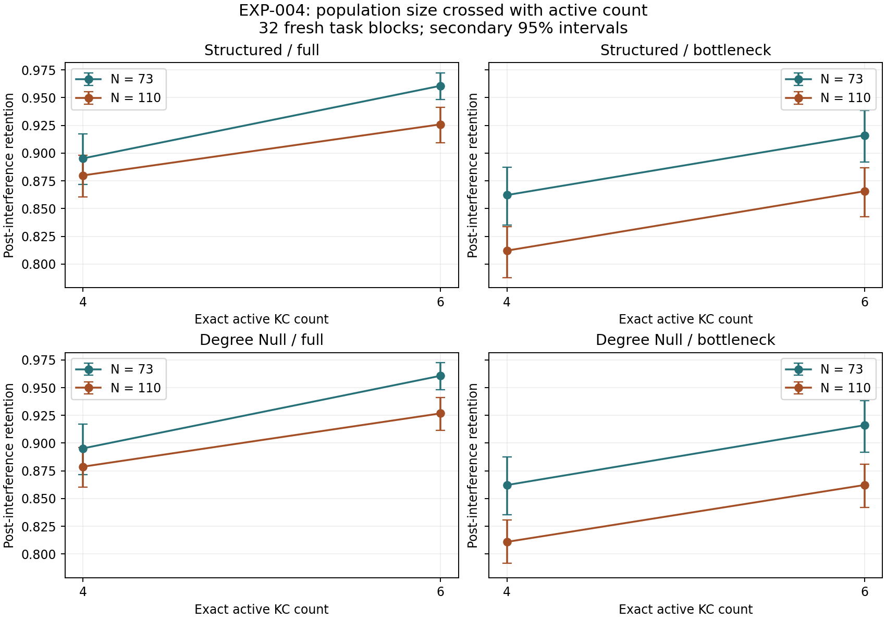

# EXP-004 active count versus population: audited results

2026-09-13. All 32 fresh evaluation blocks completed and audited: 896 conditions, 17,920 reset episodes and 19,200 configuration-episodes. Four separate development blocks were completed and audited first. No evaluation-driven selection or sample expansion.

[Prospective protocol](EXP-004-protocol.md), [precision/resource plan](../research/exp004_planning.json), [validation](../research/exp004_validation.json), [audited run](../research/runs/EXP-004-evaluation.json), [all block estimates, curves and diagnostics](../results/exp004_evaluation/analysis.json).

## Post-audit interpretation and next milestone

The crossed experiment supports a retention benefit from increasing normalized winner count and a retention cost from increasing population under the fixed readout. The primary active-count effect is +5.37 pp [3.89,6.97], while the population effect is -5.03 pp [-7.27,-2.86] (98.333333% intervals). Increasing winner count helps at both N73 and N110; the matched degree-null arm shows the same qualitative pattern in secondary analyses. The tested growth intervention has no independent retention benefit here. This conclusion is conditional on the encoder, growth operators, readout and synthetic tasks.

The interaction is -0.04 pp [-2.99865,2.98647]. Its direction is unresolved. The frozen interval technically lies inside the prospective ±3 pp band, but only barely; this boundary-sensitive bootstrap classification should not be presented as strong evidence that interaction is absent.

The full-readout control supports the activity interpretation: at N73, K6 minus K4 improves retention +6.54 pp [4.73,8.46] and early reversal +4.41 pp [2.32,6.49]. At fixed K6, N110 minus N73 reduces retention -3.47 pp [-4.65,-2.36]. At fixed K4 its retention estimate is -1.53 pp [-3.12,0.12], which is uncertain. These are secondary exploratory 95% intervals. The population penalty is larger with the bottleneck, so representation/readout interactions remain important.

The original diagonal comparison, (N110,K6) minus (N73,K4), remains positive with full readout: retention +3.07 pp [1.86,4.34] and reversal +2.17 pp [0.27,4.11] (secondary 95%). With the fixed readout its retention effect is only +0.35 pp [-1.90,2.73]; the earlier EXP-003 fixed-readout gain was not clearly reproduced. This is a separate prospective result, not a reanalysis or invalidation of the earlier sample.

Next specify a fresh N73-only diagnostic that separates winner count from activity per winner and effective learning-update size, using explicit normalization and learning-rate-matched controls. Retain N73/K6 as a promising same-assay candidate; test a new task family before claiming broader adaptation. Do not expand populations or favor this wiring prior on the present evidence. Adult transfer and the bounded lineage pilot remain later options; no new follow-up experiment has been executed.

## Primary retention contrasts

Structured growth, fixed 32-feature readout (64 learned weights). Three prespecified factorial contrasts, each with a 98.333333% block-bootstrap interval. Values below are percentage points. The practical band is ±3 points; direction and practical magnitude are separate questions.

| Contrast | Change [interval], pp | Direction supported | Entire interval within ±3 pp |
|---|---:|---|---|
| Active count | +5.37 [+3.89, +6.97] | positive | False |
| Population | -5.03 [-7.27, -2.86] | negative | False |
| Interaction | -0.04 [-3.00, +2.99] | unresolved | True |

The active-count effect averages K6−K4 at both populations. The population effect averages N110−N73 at both winner counts. The interaction is the difference between the two K effects. Their definitions were frozen before evaluation.

## Crossed retention profiles

Means are probabilities; intervals are secondary exploratory 95%. Native profiles are shared across arms, with no inflation of block count.

| Growth arm | Readout | N | K | Retention | 95% interval |
|---|---|---:|---:|---:|---|
| structured | full | 73 | 4 | 0.8952 | [0.8718, 0.9172] |
| structured | full | 73 | 6 | 0.9607 | [0.9482, 0.9724] |
| structured | full | 110 | 4 | 0.8799 | [0.8607, 0.8981] |
| structured | full | 110 | 6 | 0.9259 | [0.9091, 0.9413] |
| structured | bottleneck | 73 | 4 | 0.8622 | [0.8352, 0.8874] |
| structured | bottleneck | 73 | 6 | 0.9161 | [0.8920, 0.9383] |
| structured | bottleneck | 110 | 4 | 0.8121 | [0.7879, 0.8337] |
| structured | bottleneck | 110 | 6 | 0.8656 | [0.8428, 0.8868] |
| degree_null | full | 73 | 4 | 0.8952 | [0.8718, 0.9172] |
| degree_null | full | 73 | 6 | 0.9607 | [0.9482, 0.9724] |
| degree_null | full | 110 | 4 | 0.8788 | [0.8601, 0.8962] |
| degree_null | full | 110 | 6 | 0.9268 | [0.9115, 0.9411] |
| degree_null | bottleneck | 73 | 4 | 0.8622 | [0.8352, 0.8874] |
| degree_null | bottleneck | 73 | 6 | 0.9161 | [0.8920, 0.9383] |
| degree_null | bottleneck | 110 | 4 | 0.8110 | [0.7916, 0.8309] |
| degree_null | bottleneck | 110 | 6 | 0.8622 | [0.8418, 0.8809] |

## Secondary simple effects and capability profile

All intervals here are exploratory 95%; these are not additional primary claims. Values are percentage points.

| Arm / readout / change | Retention | Early reversal | Acquisition | Robustness .3 |
|---|---:|---:|---:|---:|
| structured / full / active_at_73 | +6.54 [+4.73, +8.46] | +4.41 [+2.32, +6.49] | +0.68 [+0.39, +0.97] | +1.71 [+1.07, +2.41] |
| structured / full / active_at_110 | +4.60 [+3.54, +5.65] | +5.33 [+4.00, +6.68] | +1.36 [+1.13, +1.58] | +1.11 [+0.76, +1.45] |
| structured / full / population_at_4 | -1.53 [-3.12, +0.12] | -3.16 [-5.41, -0.94] | -0.91 [-1.20, -0.60] | -0.09 [-0.77, +0.70] |
| structured / full / population_at_6 | -3.47 [-4.65, -2.36] | -2.24 [-3.94, -0.60] | -0.23 [-0.44, -0.01] | -0.69 [-1.05, -0.34] |
| structured / full / diagonal | +3.07 [+1.86, +4.34] | +2.17 [+0.27, +4.11] | +0.45 [+0.20, +0.72] | +1.02 [+0.41, +1.72] |
| structured / bottleneck / active_at_73 | +5.39 [+3.35, +7.57] | +3.76 [+1.27, +6.30] | +1.64 [+1.18, +2.18] | +2.69 [+1.81, +3.67] |
| structured / bottleneck / active_at_110 | +5.35 [+4.09, +6.65] | +6.60 [+5.39, +7.83] | +2.61 [+2.24, +3.00] | +2.14 [+1.52, +2.79] |
| structured / bottleneck / population_at_4 | -5.01 [-7.30, -2.72] | -6.04 [-8.38, -3.62] | -2.02 [-2.58, -1.47] | -0.48 [-1.42, +0.52] |
| structured / bottleneck / population_at_6 | -5.05 [-7.09, -3.06] | -3.20 [-5.50, -0.72] | -1.05 [-1.30, -0.79] | -1.03 [-1.57, -0.49] |
| structured / bottleneck / diagonal | +0.35 [-1.90, +2.73] | +0.56 [-2.06, +3.28] | +0.59 [+0.15, +1.12] | +1.66 [+0.77, +2.62] |
| degree_null / full / active_at_73 | +6.54 [+4.73, +8.46] | +4.41 [+2.32, +6.49] | +0.68 [+0.39, +0.97] | +1.71 [+1.07, +2.41] |
| degree_null / full / active_at_110 | +4.80 [+3.75, +5.97] | +5.19 [+3.80, +6.65] | +1.18 [+0.88, +1.49] | +1.19 [+0.86, +1.53] |
| degree_null / full / population_at_4 | -1.65 [-3.55, +0.17] | -3.00 [-5.30, -0.77] | -0.75 [-1.10, -0.40] | -0.10 [-0.69, +0.57] |
| degree_null / full / population_at_6 | -3.39 [-4.36, -2.46] | -2.22 [-3.73, -0.62] | -0.25 [-0.47, -0.02] | -0.62 [-0.92, -0.30] |
| degree_null / full / diagonal | +3.16 [+1.78, +4.56] | +2.19 [+0.42, +4.01] | +0.43 [+0.18, +0.67] | +1.09 [+0.49, +1.76] |
| degree_null / bottleneck / active_at_73 | +5.39 [+3.35, +7.57] | +3.76 [+1.27, +6.30] | +1.64 [+1.18, +2.18] | +2.69 [+1.81, +3.67] |
| degree_null / bottleneck / active_at_110 | +5.13 [+3.70, +6.55] | +5.03 [+3.35, +6.64] | +2.47 [+2.04, +2.90] | +2.24 [+1.72, +2.76] |
| degree_null / bottleneck / population_at_4 | -5.12 [-7.78, -2.09] | -5.59 [-8.21, -2.83] | -2.17 [-2.70, -1.61] | -0.47 [-1.43, +0.58] |
| degree_null / bottleneck / population_at_6 | -5.39 [-7.46, -3.31] | -4.32 [-6.40, -2.23] | -1.34 [-1.57, -1.12] | -0.92 [-1.51, -0.31] |
| degree_null / bottleneck / diagonal | +0.01 [-2.34, +2.46] | -0.56 [-3.20, +2.26] | +0.30 [-0.11, +0.76] | +1.77 [+0.88, +2.73] |

## Validation, precision and resources

47 preflight tests passed. Audit regenerated graphs and task identities, verified every raw episode hash, recomputed all summaries and inference, and checked native frozen controls at exactly chance. No exclusions or numerical failures in the successful campaign. Audit time 182.1 seconds.

Protocol 1.0 development encountered a concurrent storage-scan/atomic-rename race and is retained in `results/exp004_development_v1_failed/` with its frozen source and failure record. Version 1.1 fixed the bookkeeping race, passed a regression test and repeated all development on root-5 streams. Evaluation had not been generated; scientific settings and sample budget stayed fixed. No failed-attempt observations enter these estimates.

Evaluation used 3 CPU workers: 308.2 s wall time for this invocation, 4007.7 s summed worker episode CPU time, 85.9 MiB maximum individual worker peak memory (not total concurrent RAM), and 361.1 MiB retained before reporting. The colleague workstation and energy use were not measured.

Total recorded evaluation invocation wall time is 3281.9 seconds across 3 invocations. An infrastructure restart switched from the slow restricted filesystem wrapper to local access, preserving the frozen code, sample and checkpoints. Resume verified saved artifacts. Retained-episode CPU counters exclude any discarded uncheckpointed computation; they are not total process CPU or energy. [Execution recovery record](../research/exp004_execution_recovery.json).

Evaluation also recorded a Windows permission error while atomically replacing one checkpoint in block 1009. The remaining workers completed their queued blocks, leaving 31 complete blocks. The same frozen implementation subsequently resumed from the last valid checkpoint; the failure record and interrupted invocation are retained. No block or episode was excluded, and no scientific code or analysis plan was changed for this recovery.

Planned primary half-width at assumed SD .07 was 2.96 pp. Achieved half-widths: active count 1.54 pp, population 2.21 pp, interaction 2.99 pp. No sample was added in response to these widths.

## Interpretation limits

Winner count is exact before the readout projection. Total activity remains 10, so K6 also reduces activity per selected cell relative to K4. The intervention can change effective update size, overlap and competition. Fixed learned-weight count does not fix the representation, bottleneck mixing or effective learning rate. A population main effect averaged over K cannot by itself establish that population is irrelevant at each K.

Uncertainty is across 32 task blocks sharing one anatomy and synthetic task families. This is no adult, cross-specimen or general-adaptation test. EXP-003 remains a separate completed experiment; none of its evaluation observations enter these estimates.
