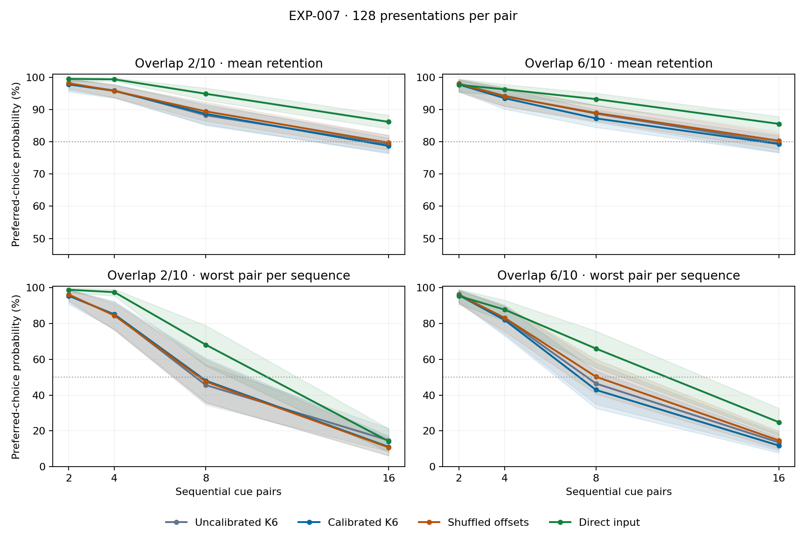

# EXP-007: participation homeostasis — audited results

2026-09-14. Eight development blocks and 32 fresh confirmation blocks completed. Ten preflight tests passed; full validation replay, checkpoint audits and one full-block replay in each stage passed. Historical experiments remain unchanged.

[Prospective protocol](EXP-007-protocol.md) · [analysis](../results/exp007_confirmation/analysis.json) · [geometry](../results/exp007_confirmation/geometry.json) · [profiles](../results/exp007_confirmation/profiles.csv) · [memory-age table](../results/exp007_confirmation/memory_age.csv) · [run record](../research/runs/EXP-007-confirmation.json)

## Prespecified conclusion

Homeostasis and ordinary tuning are practically equivalent within the prespecified ±3-point retention band in the primary condition. Calibrated K6 retains 79.28% versus 79.55% for ordinary tuning; difference -0.27 [-1.67, 1.13] pp (98.333333%).

The complete practical-success gate is not met: a retention advantage above 3 percentage points against all three primary comparators is not established, and 9 of 12 adaptation/tail noninferiority guardrails pass. The three worst-pair guardrails fail to establish preservation within the allowed margin; this does not prove harm. Equivalence above follows from the interval fitting inside the prespecified band, not simply from a nonsignificant difference.

The primary endpoint is final preferred-choice probability at 16 similar pairs, 128 presentations per pair, noise .1. Differences are homeostasis minus comparator, in percentage points; intervals have 98.333333% coverage for the three-contrast family. The practical band is ±3 points.

| Comparator | Retention difference [interval], pp |
|---|---:|
| Uncalibrated K6 | -0.27 [-1.67, 1.13] |
| Ordinary K/eta/T tuning | -0.27 [-1.67, 1.13] |
| Shuffled offsets | -1.00 [-2.53, 0.33] |

Native K6 reference is selected from the 16 K6 candidates inside the ordinary 32-candidate search. If ordinary tuning selects this same configuration, its primary contrast equals the K6-reference contrast; they are not independent replications.

## Stronger ordinary tuning and calibration

Each experimental method received 32 unique rewarded candidate settings per development condition. Ordinary methods searched K4/K6; calibrated methods searched two partial targets at fixed K6. Sham/null candidates average three replica evaluations, so candidate-search opportunities are matched but simulation costs are not. These are averages of separate learners, not a three-model ensemble at deployment. The shared eight-rate grid extends from 0.0002083333 through 0.015, with temperatures .1/.2. Direct input received 16 geometric rates over the same endpoints x two temperatures. One global setting per method was selected; no condition-specific or confirmation-driven tuning.

| Method | K | Calibration strength | Learning rate | Temperature |
|---|---:|---:|---:|---:|
| Uncalibrated K6 | 6 | 0.0 | 0.006666667 | 0.1 |
| Ordinary K/eta/T tuning | 6 | 0.0 | 0.006666667 | 0.1 |
| Calibrated K6 | 6 | 0.25 | 0.006666667 | 0.1 |
| Shuffled offsets | 6 | 0.5 | 0.006666667 | 0.1 |
| Random ordinary | 6 | 0.0 | 0.003333333 | 0.1 |
| Random calibrated | 6 | 0.5 | 0.003333333 | 0.1 |
| Direct input | — | 0.0 | 0.015000000 | 0.1 |
| Identity oracle | — | 0.0 | 0.002038619 | 0.1 |

The newly available lower learning-rate boundary was tested but not selected. Native ordinary and calibrated K6 both chose .006667. Direct input selected the upper .015 boundary, so its optimum is still bounded by the search; no global optimization claim is warranted.

Selected native calibration uses a bound of 0.052509 in normalized drive units; 49.32% of offsets reach that bound. This is bounded partial compensation, not proof of fully equalized participation or physiological thresholds. Offset fitting used 4096 unlabeled inputs; a distinct 4096-input pool measured calibration generalization. Offsets were frozen before rewarded development and unchanged during confirmation and shift testing.

## Joint capability profile

Hard condition; mean preferred-choice percentages. Below-chance is the fraction of pairs with final preferred-choice probability below .5. Worst-pair minima are computed within each replicate before averaging replicas and task blocks. These profiles are descriptive; use the primary and guardrail intervals for confirmatory claims.

| Method | Retention | Worst pair | New learning | Noise .3 | Reversal | Unchanged after reversal | Pairs below chance |
|---|---:|---:|---:|---:|---:|---:|---:|
| Uncalibrated K6 | 79.55 | 13.54 | 98.78 | 75.05 | 84.73 | 66.24 | 18.36 |
| Ordinary K/eta/T tuning | 79.55 | 13.54 | 98.78 | 75.05 | 84.73 | 66.24 | 18.36 |
| Calibrated K6 | 79.28 | 11.82 | 98.49 | 74.18 | 84.72 | 66.49 | 18.36 |
| Shuffled offsets | 80.28 | 14.67 | 98.68 | 75.23 | 84.48 | 64.70 | 17.06 |
| Random ordinary | 76.74 | 9.85 | 97.92 | 72.04 | 81.83 | 66.09 | 20.57 |
| Random calibrated | 77.09 | 12.09 | 98.01 | 72.32 | 81.93 | 66.56 | 18.95 |
| Direct input | 85.52 | 24.88 | 98.91 | 80.98 | 88.30 | 71.54 | 11.13 |
| Identity oracle | 99.74 | 98.38 | 99.74 | 99.74 | 99.74 | 99.75 | 0.00 |
| Calibrated, K6-reference eta/T | 79.28 | 11.82 | 98.49 | 74.18 | 84.72 | 66.49 | 18.36 |
| Shuffled, K6-reference eta/T | 80.28 | 14.67 | 98.68 | 75.23 | 84.48 | 64.70 | 17.06 |

## Adaptation and tail guardrails

Homeostasis minus comparator, pp. Each lower bound is one-sided at alpha .05/12; passing requires lower bound strictly above −3. Failure to pass does not by itself establish harm.

| Comparator | Outcome | Mean difference | Simultaneous lower bound | Pass |
|---|---|---:|---:|---|
| Uncalibrated K6 | new_learning | -0.28 | -0.87 | yes |
| Uncalibrated K6 | reversal | -0.01 | -2.24 | yes |
| Uncalibrated K6 | unchanged | 0.25 | -2.47 | yes |
| Uncalibrated K6 | worst_pair | -1.73 | -7.97 | no |
| Ordinary K/eta/T tuning | new_learning | -0.28 | -0.87 | yes |
| Ordinary K/eta/T tuning | reversal | -0.01 | -2.24 | yes |
| Ordinary K/eta/T tuning | unchanged | 0.25 | -2.47 | yes |
| Ordinary K/eta/T tuning | worst_pair | -1.73 | -7.97 | no |
| Shuffled offsets | new_learning | -0.18 | -0.63 | yes |
| Shuffled offsets | reversal | 0.24 | -1.94 | yes |
| Shuffled offsets | unchanged | 1.79 | -0.42 | yes |
| Shuffled offsets | worst_pair | -2.85 | -8.11 | no |

## Participation and interference diagnostics

Hard condition. Effective participation=(sum cell counts)^2/sum squared cell counts. Presented counts include both alternatives; chosen counts include actual acquisition updates only. Pair-margin perturbation measures absolute value-difference changes of previously learned clean cue pairs per new update, averaged across old pairs. These are descriptive diagnostics, not proof of mediation.

| Method | Unused presented (%) | Effective presented cells | Unused chosen (%) | Noise stability | Cross-memory cosine | Absolute old-pair margin change |
|---|---:|---:|---:|---:|---:|---:|
| Uncalibrated K6 | 40.88 | 11.49 | 44.61 | 0.9502 | 0.5393 | 0.017005 |
| Calibrated K6 | 35.66 | 11.91 | 39.94 | 0.9389 | 0.5278 | 0.017500 |
| Shuffled offsets | 41.20 | 11.51 | 44.43 | 0.9475 | 0.5360 | 0.017631 |
| Random ordinary | 36.17 | 13.40 | 39.85 | 0.9373 | 0.5035 | 0.011311 |
| Random calibrated | 30.62 | 14.05 | 34.80 | 0.9260 | 0.4876 | 0.011329 |

Participation changed without a useful retention gain. On the hard condition, the unused presented-cell fraction falls from 40.88% to 35.66%; its paired change is -5.22 [-6.25, -4.20] pp (descriptive 95%). Effective participation increases by 0.421 cells, while noisy-to-clean cosine changes by -1.13 [-1.39, -0.87] percentage points. Cross-memory cosine also decreases, but the paired interval for absolute old-pair margin perturbation includes zero; reduced average overlap did not establish reduced update interference. Clean and noisy winner margins narrow. These results are consistent with a recruitment/stability tradeoff, not uniquely identified causal mediation. [Paired geometry diagnostics](../results/exp007_confirmation/geometry_contrasts.json).

Both calibrated and uncalibrated K6 keep total activity 10 and squared norm 100/6. Actual update errors, choices and clipping can differ. Selected fixed-setting contrasts reuse the reference K6 learning rate/temperature, with no extra tuning:

| Matched comparison versus K6 reference | Retention difference [95% interval], pp |
|---|---:|
| Calibrated, K6-reference eta/T | -0.27 [-1.42, 0.89] |
| Shuffled, K6-reference eta/T | 0.73 [-0.34, 1.82] |

### Exact assignment control

Development selected different strengths for homeostasis (.25) and the optimized sham (.5). Before confirmation, a [transparent addendum](EXP-007-matched-sham-addendum.md) froze an additional no-search control using exactly the homeostasis offset multiset and eta/T, with three shuffled assignments. Original primary comparisons and sample size were unchanged. Both the matched control and homeostasis use the same hard-condition streams; three replicas are averaged within blocks. This is a development-informed addition, not a confirmation-driven analysis choice. [Supplemental audited results](../results/exp007_matched_sham/analysis.json).

| Outcome | Homeostasis minus exact-multiset sham [95% interval], pp |
|---|---:|
| retention | -0.75 [-1.91, 0.33] |
| worst_pair | -2.24 [-6.06, 1.36] |
| new_learning | -0.15 [-0.42, 0.09] |
| forgetting | 0.60 [-0.50, 1.78] |
| noise_retention | -0.88 [-1.65, -0.12] |
| reversal | 0.21 [-1.41, 2.00] |
| unchanged | 1.90 [0.01, 3.90] |
| below_chance | 1.82 [0.00, 3.65] |

## Certified load

Largest tested load whose mean retention and immediate acquisition lower bounds exceed .80, with all lower loads also passing. Bonferroni family covers 224 checks across seven experimental reported models, two similarities, two regimes, four loads and two endpoints; one-sided approximate bootstrap bounds. This does not certify every memory or post-reversal performance. Failure to certify is not proof of subthreshold population mean.

| Method | Overlap2,128/pair | Overlap6,128/pair | Overlap2,512 total | Overlap6,512 total |
|---|---:|---:|---:|---:|
| Uncalibrated K6 | 8 | 8 | 8 | 8 |
| Ordinary K/eta/T tuning | 8 | 8 | 8 | 8 |
| Calibrated K6 | 8 | 8 | 8 | 8 |
| Shuffled offsets | 8 | 8 | 8 | 8 |
| Random ordinary | 8 | 8 | 8 | 8 |
| Random calibrated | 8 | 8 | 8 | 8 |
| Direct input | 16 | 16 | 16 | 16 |

Shading is pointwise descriptive 95% uncertainty. Horizontal lines show the .80 mean-retention threshold and .50 chance for the worst-pair panel; they do not define confidence-bound certification. [Fixed-total-exposure figure](../results/exp007_confirmation/retention_total.png).

## Held-out input-distribution shift

The first 20 PN channels are attenuated by .5 throughout training, reversal and probes; calibration is unchanged. The gain multiplies the already clipped noisy observations, including their noise, and clean prototypes. It is invertible at the PN level, so raw input information is preserved; the sparse encoder and bounded learner can nevertheless respond differently. This clarifies the protocol's broad information-loss caveat. The condition was absent from development selection. It is one defined input shift, not cross-circuit validation. Values below are homeostasis-minus-comparator retention differences with descriptive 95% intervals at load 16/128 per pair.

| Overlap | Versus K6 reference | Versus ordinary tuning | Versus shuffled | Versus direct input |
|---|---:|---:|---:|---:|
| 2 | 1.11 [-0.35, 2.55] | 1.11 [-0.35, 2.55] | 0.43 [-1.40, 2.20] | -5.82 [-7.99, -3.70] |
| 6 | -0.23 [-1.91, 1.43] | -0.23 [-1.91, 1.43] | 0.11 [-1.82, 2.12] | -7.47 [-10.07, -4.71] |

Shifted full profiles, oracle checks and raw arrays are retained. Direct/oracle controls help distinguish encoder/learner sensitivity from task invalidity. No retuning on shift results is permitted.

## Precision, verification and resources

Development's maximum primary paired SD was 0.04195. The prospective inflation/precision rule requested 26 blocks before rounding and bounds, producing 32 confirmation blocks. Projected primary halfwidth was 2.22 pp; this was an estimate from only eight development blocks, not a guaranteed interval width. Confirmation was not extended.

Preflight covered scalar chosen updates and pair-margin changes, zero-offset encoder and complete sequence equivalence, calibration bounds/direction and shuffle invariants, lower-rate budgets, disjoint calibration streams, task overlap and shift transformation, persistent weights, read-only probes, null-graph invariants and oracle adequacy. Full validation and stage replays are exact. Every checkpoint passed checksum, regenerated task digest, weight continuity and metric recomputation audits. Three sham/null replicas are averaged inside each independent task block.

Three fixed random anatomies were calibrated before development; uncertainty is conditional on these anatomies. Compared with EXP-006, both tuning and random-anatomy sampling design changed, so historical percentages are contextual rather than paired intervention estimates. No independent-agent review was performed.

| Stage | Block CPU seconds | Summed worker-wall seconds | Peak worker MB | Checkpoint MB |
|---|---:|---:|---:|---:|
| development | 565.97 | 581.03 | 94.91 | 115.46 |
| confirmation | 1809.16 | 1886.21 | 70.35 | 76.87 |

These resource totals exclude full replay/audit, reporting and the supplemental control; summed worker time is not elapsed campaign time. Calibration took 22.06 wall seconds; supplemental-control block computation totals 48.10 summed worker-wall seconds, excluding its replay. Local bundled CPython/NumPy and three CPU workers were used. Plotting reads the existing cached Matplotlib installation under read-access escalation; no paid compute or separate workstation run.

Sparse models retain 73 cells and 146 reward-learned weights. Calibrated/sham versions add 73 stored offsets, with 72 independent values after centering, and unlabeled fitting/data costs. Direct input uses 80 learned weights. Oracle receives privileged identity and is only a validation control. The baseline already normalizes each KC's total incoming projection weight to one; this experiment tests additional compensation of residual participation imbalance. No new biological dynamics, online homeostasis, gain intervention, growth or cross-circuit test was implemented.

Priority3 is a bounded experimental test, not a universal verdict on homeostasis. Interpret practical effects, guardrails and transfer jointly before choosing the prediction to validate in another circuit. Do not tune or extend this completed confirmation sample.
