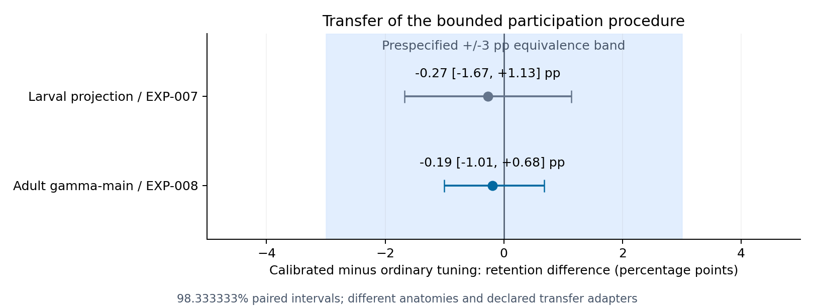
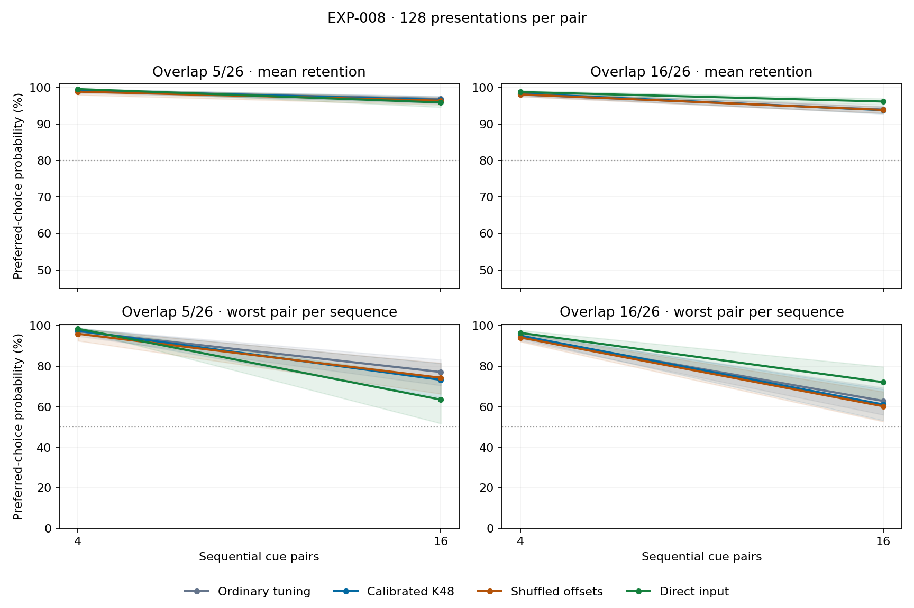

# EXP-008: adult circuit transfer — audited results

2026-09-14. Eight development and 24 fresh confirmation blocks completed. Nine preflight tests, exact full validation replay, all checkpoint audits and one full-block replay per stage passed. Historical EXP-002–007 scientific sources/protocols/results match their preservation hashes.

[Protocol](EXP-008-protocol.md) · [Analysis](../results/exp008_confirmation/analysis.json) · [Anatomy](../results/exp008_anatomy/record.json) · [Run record](../research/runs/EXP-008-confirmation.json) · [Profiles](../results/exp008_confirmation/profiles.csv) · [Memory age](../results/exp008_confirmation/memory_age.csv)

## Transfer decision

Adult calibration minus ordinary tuning: -0.19 [-1.01, 0.68] pp (98.333333% interval). Transfer classification: equivalent; informative-benchmark gate passed.

The bounded retention limitation transfers to this independently reconstructed adult subcircuit: redistributing participation did not yield a practically useful mean-retention gain beyond strong ordinary tuning. This extends the empirical finding beyond the larval anatomy, but does not establish its causal explanation or generalization to other task families.

The prediction was practical retention equivalence within +/-3 pp, based on EXP-007. Statistical equivalence requires the whole simultaneous interval inside the band; absence of significance is insufficient. Useful benefit requires a lower bound above +3 pp, harm an upper bound below -3 pp. Intervals crossing these boundaries are inconclusive. A ceiling/floor or learnability failure prevents treating equivalence as informative transfer.

The joint intervention-success gate is not met. 9/12 adaptation/tail noninferiority guardrails pass; a failed noninferiority test does not establish harm. In this run the three worst-pair guardrails fail, so preserving the performance of the worst memories is not established.

| Comparator | Calibrated minus comparator retention [98.333333% interval], pp |
|---|---:|
| Uncalibrated K48 | -0.16 [-0.66, 0.32] |
| Ordinary tuning | -0.19 [-1.01, 0.68] |
| Optimized shuffled offsets | -0.07 [-0.64, 0.53] |

## What was transferred

Adult hemibrain:v1.1 main-calyx contacts from 104 connected monoglomerular PNs to 590 gamma-main KCs: 4,878 positive edges, 85,151 contacts. Subtype/ROI/ID filters were chosen before learning. Raw contacts were normalized per KC. The source archive contains non-cropped traced neurons; unknown residual completeness and the unused author positional exclusion list are disclosed in the protocol.

The intervention procedure was transferred with new offsets fitted on 4,096 unlabeled development-calibration observations, checked on a separate 4,096, then frozen. No adult evaluation inputs or rewards calibrated offsets. Activity density maps larval K4/K6 to adult K32/K48; sparse learning rates scale eightfold to preserve nominal update scale. Inputs use 26/104 active coordinates and 5/16 shared coordinates. Direct rates adjust for its input norm. This is procedure transfer with declared adapters, not reuse of larval fitted parameters.

The online learner and two synthetic outputs remain. This tests an independently reconstructed animal/adult subcircuit within the same associative assay. It neither isolates anatomy as the causal difference nor establishes physiological homeostasis, cross-task generalization, or an anatomical population effect. Synthetic PN coordinates are independent even when biological PNs share glomerular identity.

## Frozen development choices

Each method received 32 unique rewarded candidates per condition across eight development blocks. Null/sham methods average three fixed replicas, so simulation costs differ. One global configuration was selected using five equally weighted outcomes across both loads, similarities and exposure regimes. The K48 reference reuses ordinary search; when ordinary selects it, those contrasts are identical, not independent replications.

| Method | K | Strength | Eta | Temperature |
|---|---:|---:|---:|---:|
| Uncalibrated K48 | 48 | 0.0 | 0.013333333 | 0.1 |
| Ordinary tuning | 32 | 0.0 | 0.013333333 | 0.1 |
| Calibrated K48 | 48 | 0.5 | 0.026666667 | 0.1 |
| Optimized shuffled offsets | 48 | 0.5 | 0.026666667 | 0.1 |
| Random ordinary | 32 | 0.0 | 0.013333333 | 0.1 |
| Random calibrated | 48 | 0.25 | 0.053333333 | 0.1 |
| Direct input | 0 | 0.0 | 0.004338062 | 0.1 |
| Identity oracle | 0 | 0.0 | 0.003605624 | 0.1 |

Precision rule: maximum development paired SD 0.02466; uncapped n=9; frozen n=24; projected halfwidth 1.51 pp. This projection was not a guarantee. Confirmation was not extended.

## Primary condition and adequacy

Sixteen high-similarity cue pairs, 128 presentations per pair, preferred-choice probabilities. Mean percentages below are descriptive; primary/guardrail intervals govern inference.

| Method | Retention | New learning | Worst pair | Noisy retention | Reversal | Unchanged |
|---|---:|---:|---:|---:|---:|---:|
| Uncalibrated K48 | 93.91 | 98.28 | 65.16 | 86.56 | 92.64 | 87.21 |
| Ordinary tuning | 93.94 | 98.61 | 62.94 | 86.15 | 92.38 | 86.87 |
| Calibrated K48 | 93.74 | 98.78 | 61.20 | 86.51 | 93.33 | 86.14 |
| Optimized shuffled offsets | 93.82 | 98.83 | 60.32 | 86.64 | 92.40 | 86.45 |
| Random ordinary | 94.19 | 98.78 | 63.44 | 87.10 | 93.43 | 88.65 |
| Random calibrated | 93.90 | 99.08 | 58.19 | 87.27 | 92.84 | 85.83 |
| Direct input | 96.12 | 99.08 | 72.20 | 92.62 | 92.68 | 92.43 |
| Identity oracle | 99.59 | 99.59 | 96.25 | 99.59 | 99.63 | 99.53 |
| Calibrated at reference eta/T | 94.15 | 98.34 | 68.21 | 86.70 | 93.09 | 86.66 |
| Shuffled at reference eta/T | 93.92 | 98.31 | 65.84 | 86.49 | 92.58 | 86.76 |
| Exact-multiset sham | 93.82 | 98.83 | 60.32 | 86.64 | 92.40 | 86.45 |

| Informative-benchmark check | Pass |
|---|---|
| ordinary_new_learning | True |
| oracle_retention | True |
| oracle_new_learning | True |
| below_ceiling | True |
| above_floor | True |
| passed | True |

Ordinary retention has a descriptive95% interval of [92.94, 94.89]%. Its upper bound is close to the prespecified95% ceiling threshold, which it passes. This supports the written adequacy decision, not unlimited headroom or generalization to heavier loads.

The gate requires ordinary acquisition lower95% >80%, oracle retention/acquisition lower95% >95%, and ordinary retention interval wholly between 55% and 95%. No parameter, task or sample change followed this assessment. Only loads4/16 were tested: no certified-capacity threshold is claimed.

## Participation and diagnostic interpretation

| Method | Unused presented cells (%) | Effective presented cells | Noise stability | Cross-memory cosine |
|---|---:|---:|---:|---:|
| Uncalibrated K48 | 25.61 | 123.32 | 0.912 | 0.393 |
| Ordinary tuning | 37.26 | 91.19 | 0.906 | 0.359 |
| Calibrated K48 | 24.34 | 125.68 | 0.911 | 0.387 |
| Optimized shuffled offsets | 26.17 | 122.86 | 0.912 | 0.394 |
| Exact-multiset sham | 26.17 | 122.86 | 0.912 | 0.394 |
| Random ordinary | 37.80 | 90.62 | 0.905 | 0.357 |
| Direct input | 0.00 | 97.47 | 0.990 | 0.659 |

Effective participation is `(sum counts)^2/sum(counts^2)` over presented acquisition observations, not anatomical cell count or memory capacity. Geometry, clipping, update norms and old-pair margin changes are descriptive. [Paired geometry contrasts](../results/exp008_confirmation/geometry_contrasts.json) do not establish causal mediation.

## Exact-multiset control

Three independently shuffled copies of the selected homeostasis offset vector, with identical K/eta/T, were prespecified and frozen before confirmation. Values are homeostasis minus exact-multiset sham; descriptive95% intervals.

| Outcome | Difference [95% interval], pp |
|---|---:|
| retention | -0.07 [-0.54, 0.42] |
| worst_pair | 0.88 [-3.74, 5.15] |
| new_learning | -0.05 [-0.19, 0.06] |
| forgetting | 0.02 [-0.44, 0.47] |
| noise_retention | -0.13 [-0.54, 0.29] |
| reversal | 0.93 [0.25, 1.64] |
| unchanged | -0.31 [-1.43, 0.76] |
| below_chance | -0.17 [-1.22, 0.87] |

Development selected identical settings for optimized sham and homeostasis, so optimized sham and the exact-multiset sham coincide here. These are the same control, not independent corroborating evidence.

## Adaptation and tail guardrails

| Comparator | Outcome | Mean difference (pp) | Simultaneous lower bound (pp) | Pass |
|---|---|---:|---:|---|
| Uncalibrated K48 | new_learning | 0.50 | 0.22 | True |
| Uncalibrated K48 | reversal | 0.69 | -0.60 | True |
| Uncalibrated K48 | unchanged | -1.07 | -2.67 | True |
| Uncalibrated K48 | worst_pair | -3.95 | -9.95 | False |
| Ordinary tuning | new_learning | 0.17 | -0.08 | True |
| Ordinary tuning | reversal | 0.95 | -0.41 | True |
| Ordinary tuning | unchanged | -0.73 | -2.83 | True |
| Ordinary tuning | worst_pair | -1.74 | -9.53 | False |
| Optimized shuffled offsets | new_learning | -0.05 | -0.24 | True |
| Optimized shuffled offsets | reversal | 0.93 | 0.04 | True |
| Optimized shuffled offsets | unchanged | -0.31 | -1.83 | True |
| Optimized shuffled offsets | worst_pair | 0.88 | -5.49 | False |

One-sided alpha .05/12; all lower bounds must exceed -3 pp. Inference is conditional on this adult anatomy and three fixed null anatomies; task blocks are independent units. Bootstrap intervals are approximate.

Bands are descriptive pointwise95% intervals. [Fixed-total-exposure plot](../results/exp008_confirmation/retention_total.png).

## Resources and reproducibility

| Stage | Block CPU seconds | Summed worker-wall seconds | Peak worker MB | Checkpoint MB |
|---|---:|---:|---:|---:|
| development | 1794.84 | 2026.56 | 228.75 | 326.93 |
| confirmation | 2442.20 | 2529.66 | 169.03 | 83.57 |

Calibration took 75.53 wall seconds. Table excludes full replay/audits/reporting; summed worker time is not campaign elapsed time. Local bundled Python/NumPy, three CPU workers, no paid compute. Sparse models use 1,180 learned weights; direct input208; calibrated/sham models additionally store590 offsets (589 independent after centering) and require unlabeled fitting. Oracle uses privileged identity and is only a task-validity control.

Source/runtime/anatomy/calibration contracts, task digests, per-block checksums, exact replay and metric recomputation are retained. [Validation](../research/exp008_validation.json), [development freeze](../results/exp008_development/contract.json), [confirmation freeze](../results/exp008_confirmation/contract.json), [historical preservation](../research/exp008_historical_hashes.json). No performance-based exclusions or confirmation-driven changes.

## Branch decision

Interpret the transfer classification with adequacy, geometry and tail results. Even informative equivalence extends a bounded limitation across two anatomical settings rather than proving the explanation or universal uselessness of homeostasis. Growth still requires evidence that new features address a representation limit. Rewiring requires predictive collision evidence. Evolution remains conditional on a held-out task-family battery robust to exploitation by selection; this same-assay adult run does not meet that condition alone.
