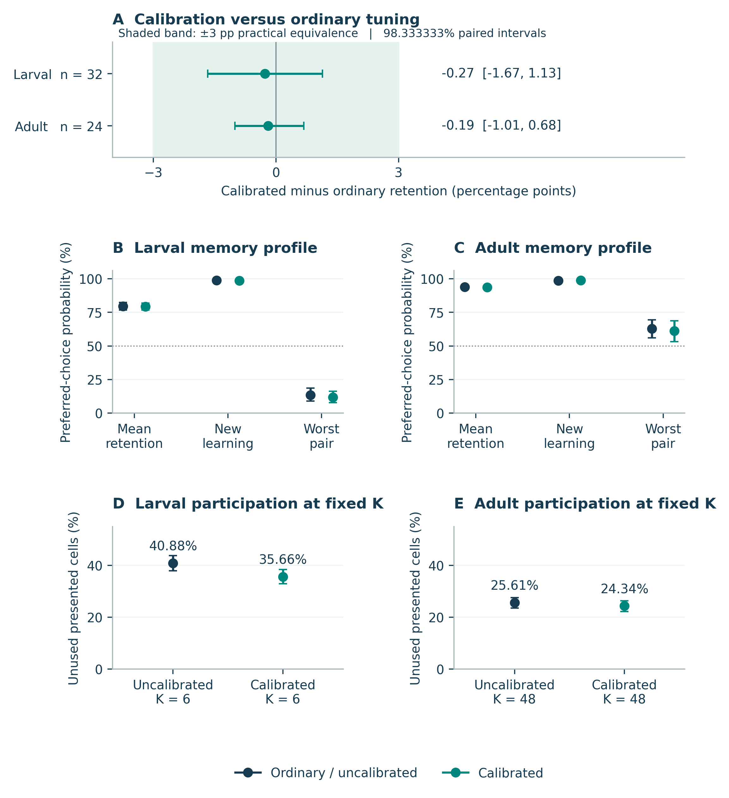
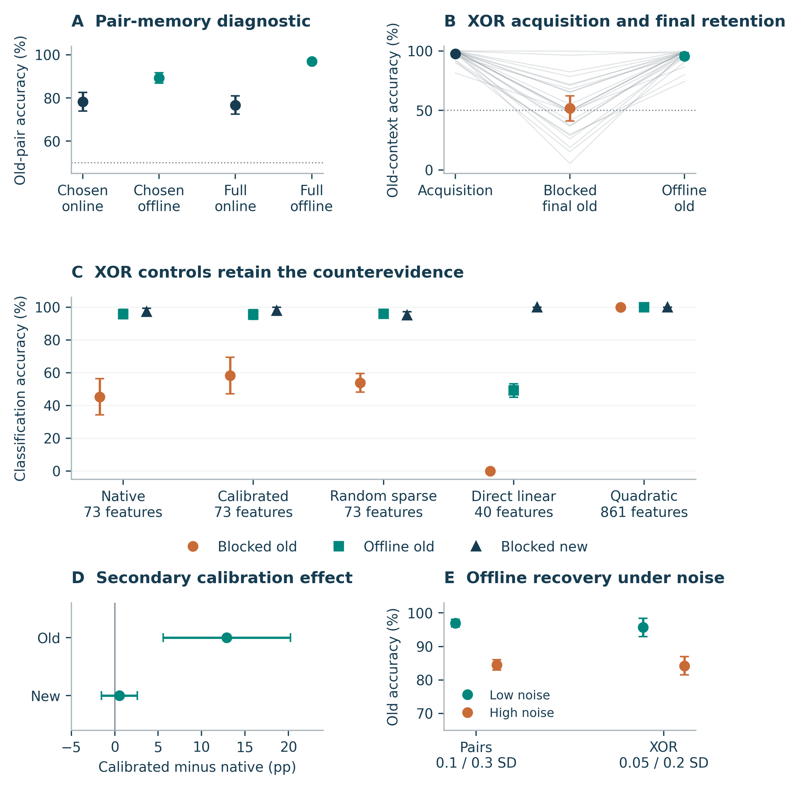
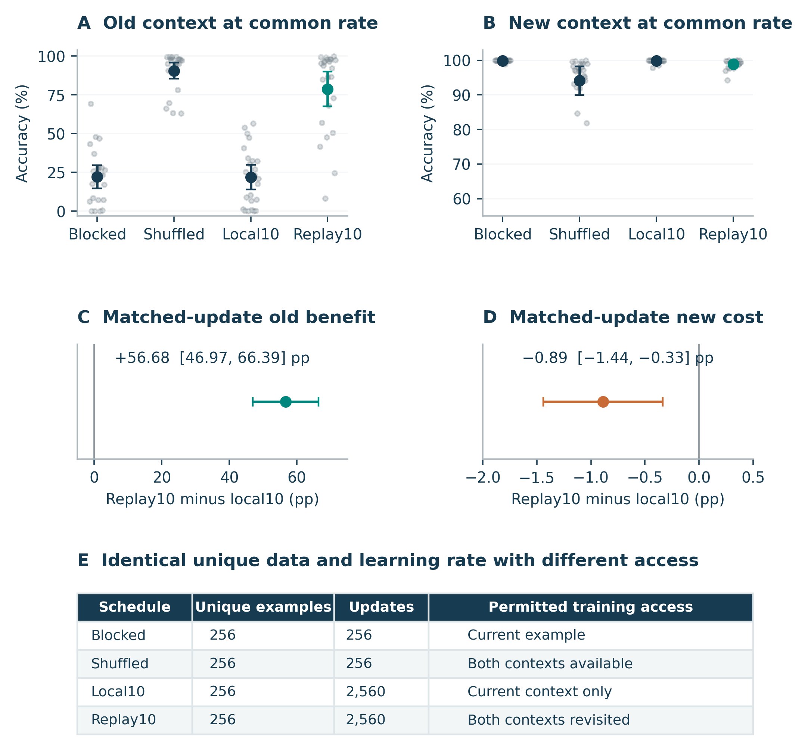

# Bounded participation calibration and memory retention

### Evidence from connectome derived mushroom body models

Thomas Julsgaard

MSc student in Software Design, IT University of Copenhagen

16 September 2026

## Abstract

Participation balance and retained behavior measure different properties of a learning system. We evaluated a bounded, frozen participation-calibration procedure in normalized feedforward projections derived from larval and adult Drosophila mushroom-body anatomy. Relative to ordinary parameter tuning with equal candidate counts, calibration changed final associative-retention probability by −0.27 percentage points in the larval model (98.333333% interval −1.67 to 1.13; 32 task blocks) and −0.19 in the adult model (−1.01 to 0.68; 24 blocks). Both intervals fell within a prospective ±3-point practical-equivalence band. Larval recruitment increased, but preservation of the worst memories was not established in either anatomy.

Subsequent larval diagnostics separated frozen-feature readability from sequential readout performance. Offline full-outcome fitting exceeded supervised online old-pair accuracy by 20.26 points (95% interval 16.46 to 24.05). A prospective two-context XOR assay supported the same restricted prediction: offline old-context accuracy was 95.67%, compared with 51.73% under the tuned blocked learner, a paired gap of 43.95 points (34.23 to 53.67). At a common rate and update count, revisiting historical examples improved old accuracy by 56.68 points but reduced new accuracy by 0.89 points. Counterexamples remain consequential: random sparse features matched offline performance, larger quadratic features retained both contexts sequentially, and calibration improved XOR retention in a secondary comparison.

These measurements delimit one calibration procedure and a family of learning conditions. They establish neither anatomical superiority nor a biological memory limit. Their practical value is to connect participation, individual-memory outcomes, readout access and controlled retention tests within an auditable computational study.

**Keywords** Drosophila; mushroom body; connectome-derived models; participation calibration; sequential learning; memory retention

**Research scope** Computational experiments on synthetic tasks. No new animal experiment, whole-brain simulation or neuron-count scaling law is reported.

<!-- PAGE -->
## 1 Introduction

A connectome constrains who can communicate with whom, but it does not by itself determine what a model will learn or retain. A computational model built from anatomical contacts also requires an input distribution, a transformation from contacts to effective weights, an activity rule and a learning procedure. Performance therefore belongs to the assembled system. An apparently favorable activity statistic must be tested against the behavior that motivated the intervention.

The mushroom body offers a well-characterized anatomical starting point for this question. Eichler and colleagues reconstructed the larval learning and memory circuit [1]; the hemibrain and adult mushroom-body analyses provide complementary adult resources [2,3]. Here, selected projection-neuron to Kenyon-cell contacts supply fixed feature projections. The model deliberately omits much of the circuit described by these sources. Anatomical provenance is a constraint on the projection, rather than validation of the model's synthetic output dynamics.

The immediate motivation came from earlier experiments in this project. Increasing the number of active larval features from four to six improved retained performance even after controls for update scale and tuning. Longer sequences nevertheless produced substantial losses of individual memories. This suggested testing whether distributing participation more evenly could improve retained behavior. The resulting study asks whether a specified partial-calibration procedure adds a practically useful benefit beyond ordinary tuning, and whether a poor retention score necessarily means that the frozen features no longer distinguish old associations.

## 2 Relation to prior work

Compensation benefits are established computational precedent. Abdelrahman, Vasilaki and Lin showed that compensating variability in a mushroom-body model could improve memory performance [4]. Their fitted graded-response regime differs from the normalized top-K projection used here. We distinguish that conceptual motivation from direct reuse of their supplied parameters in a separate positive reference, and from use of their projection-neuron annotations for the adult extraction. These are three distinct dependencies.

Sparse connectivity and expansion tradeoffs also precede this work [5]. Zou, Zang and Ji studied fly-inspired expansion with trainable output layers and continual-learning procedures [6]. The later Fly-CL framework combines pretrained features, sparse random projection, top-k selection and streaming ridge classification [7]. We inspected the latter's March 2026 arXiv version, whose record identifies it as accepted at ICLR 2026. Neither implementation nor trained parameters were reused in our diagnostics. Differences in expansion, coding density, supervision and learning rules preclude treating the present results as replications or refutations of those systems.

Rehearsal against forgetting is similarly established [8]. The contribution here is the measured outcome of a bounded calibration intervention under ordinary-tuning controls, its prospective adult follow-up, and subsequent diagnostics with counterevidence retained. It is a focused empirical report, with no claim to a new forgetting mechanism or worldwide priority.

<!-- PAGE -->
## 3 Methods

### 3.1 Anatomical projections and synthetic readouts

The larval projection was extracted from Supplementary Table 1 of Eichler et al. [1]. The selected left-side subset contains 40 projection neurons (PNs) and 73 mature Kenyon cells (KCs), with 365 positive neuron-pair edges and 2,188 contacts. Young KCs were excluded and original indices preserved. The adult extraction uses hemibrain v1.1 main-calyx CA(R) contacts to gamma-main KCs (KCg-m), with monoglomerular PN annotations from the pinned compensation repository [2–4]. It contains 104 connected PNs, 590 KCs, 4,878 positive neuron-pair edges and 85,151 contacts. These subsets and their normalization are project transformations of published resources.

Each KC's incoming contact weights sum to one. Anatomical counts are not assumed to be measured physiological efficacies. Synthetic inputs drive a feedforward projection; two synthetic opponent output vectors supply learned values. Adult PN coordinates remain independent even when corresponding biological PNs share a glomerular identity. The simulations contain no measured MBON dynamics, recurrent circuit or explicit dopamine model.

For input u, normalized projection P and offset vector θ, the drive is z = uP − θ. The K highest-ranked drives receive amplitude 10/K; all other features are zero. Total activity is therefore 10 and squared feature norm is 100/K. The generic opponent delta rule uses error e = y − x·(w⁺ − w⁻), followed by w⁺ ← max(0, w⁺ + ηxe) and w⁻ ← max(0, w⁻ − ηxe). Maxima act coordinatewise. Earlier development implemented and checked the separate mixed-valence Eq. 8 from Bennett, Philippides and Nowotny against their author code [9,10]. That validation does not make the later generic rule a complete Bennett model or establish biological validity.

### 3.2 Bounded participation calibration

Calibration acts after incoming-weight normalization. Separate pools of 4,096 unlabeled observations fit and validate offsets before rewarded development. A target interpolates baseline winner frequency toward K/N with strength 0.25 or 0.5. One hundred fitting steps adjust centered offsets, bounded in absolute value by one-quarter of the median positive drive standard deviation. Offsets remain frozen throughout evaluation. This is partial participation calibration, not full activity equalization or online physiological homeostasis.

Each calibration study allocates 32 rewarded candidate settings per method and development condition. Ordinary tuning varies K, learning rate and decision temperature; calibrated methods vary calibration strength, rate and temperature at the higher K. Equal candidate counts do not imply identical search spaces, computation or fitted-parameter counts. Three fixed randomized or shuffled instances are averaged within each task block. They are not independent replicates or a deployed ensemble. Exact settings and data provenance are recorded in the supplement.

### 3.3 Associative retention and inference

The primary condition trains 16 similar cue pairs sequentially with 128 presentations per pair, observation noise SD 0.1 and stochastic 0.8/0.2 outcomes. Only the chosen outcome drives each update. Final mean preferred-choice probability is the retention endpoint. There are 32 fresh larval and 24 fresh adult confirmation blocks. Paired block-bootstrap intervals retain 98.333333% coverage for the three primary contrasts; practical equivalence requires the entire interval inside ±3 percentage points. Twelve adaptation and tail guardrails separately assess preservation. Inference is conditional on fixed anatomy, offsets and null instances.

<!-- PAGE -->
### 3.4 Frozen feature diagnostics

The pair-memory diagnostic uses 24 fresh larval blocks to compare chosen-outcome and full-outcome offline ridge fits with corresponding online feedback conditions. The endpoint is deterministic correct preference on new noisy probes of the first 15 pairs in a 16-pair sequence; ties count one-half. It differs from stochastic preferred-choice probability in the calibration studies. Full-feedback arms receive 4,096 labeled observations, versus 2,048 chosen updates. The chosen-only fit uses the online learner's archived choices and stochastic outcomes. No fit receives held-out probes, latent valence labels or expected rewards.

Ridge penalties are selected from four candidates on six development blocks; the online rate remains fixed at 1/150. Offline fitting has simultaneous historical access and a different objective and solver. It is a diagnostic of readable information, not an equal-budget online competitor or a proven capacity bound. Unclipped and ten-pass online controls test additional aspects of the learning procedure. All sparse feature vectors have squared norm 100/6.

### 3.5 Nonlinear compound task

The prospective transfer assay is a supervised two-context XOR task. Each block permutes 40 input channels into four five-channel component bundles and 20 nuisance channels, with randomized context order and label polarity. Inputs combine one bundle per factor, continuously varying strengths, nuisance channels and clipped Gaussian noise. Two contexts are learned in sequence; the same second component has opposite labels across contexts. Both labels occur within each context and all four logical combinations occur in training.

There are 128 training observations per context and 512 fresh evaluation observations per context at each noise level. Training and ordinary evaluation noise have SD 0.05; the high-noise evaluation uses 0.2. The same 256 training observations and exact labels feed every learner. Frozen native, calibrated and randomized sparse encoders are compared with 40-dimensional direct input and an 861-dimensional quadratic representation. The existing larval offsets transfer unchanged. Direct and quadratic norms are scaled using all training inputs, including the later context, but no evaluation data.

Six development blocks choose among four learning rates per representation and schedule and four ridge penalties. Twenty-four confirmation blocks are then held fixed. The primary prediction is a conjunction: native/calibrated average offline old-context accuracy at least 80%, a lower 95% confidence bound above 5 points for the offline-minus-blocked gap, and a lower bound above 5 points for acquisition-to-final loss. Recovery is a mean gate, not a lower-bound guarantee. Paired Student-t intervals use 23 degrees of freedom; secondary contrasts are unadjusted descriptions.

### 3.6 Schedule and resource controls

Blocked and shuffled one-pass schedules perform 256 updates. Local10 repeats the current context ten times before switching; replay10 makes ten complete passes through both contexts. Both perform 2,560 updates. The strongest revisiting contrast fixes η = 1/150 as well as observations, labels and update count. Historical availability and ordering change together. Shuffling requires both contexts available simultaneously. The simulator materializes data for reproducibility, so these access restrictions do not demonstrate actual streaming-memory savings. Supplementary methods distinguish this control from separately tuned schedule comparisons.

<!-- PAGE -->
## 4 Results

### Bounded calibration and retained behavior

**Figure 1. Participation changes do not guarantee retained behavior.** A, calibrated-minus-ordinary mean retention, with original 98.333333% paired block-bootstrap intervals and the prospective ±3-point equivalence band. B–C, mean retention, immediate new learning and mean within-sequence worst-pair probability. D–E, unused presented cells at matched active count: larval K6 and adult K48. B–E use descriptive 95% intervals. Adult ordinary tuning selects K32, so panel E deliberately uses the K48 reference to separate recruitment changes from winner-count changes. Independent units are 32 larval or 24 adult task blocks, conditional on their fixed projections and offsets. The three worst-memory noninferiority guardrails fail in each study; this does not prove intervention harm. Anatomical data derive from Eichler et al. [1] and the hemibrain resources [2,3], with adult PN annotations and compensation precedent from Abdelrahman et al. [4].

<!-- PAGE -->
### 4.1 Mean equivalence coexists with poor individual memories

Larval calibrated retention was 79.28%, compared with 79.55% under ordinary tuning. The paired difference was −0.27 percentage points [−1.67, 1.13]. In the adult model, the corresponding difference was −0.19 points [−1.01, 0.68]. Both original 98.333333% intervals lie entirely inside the predeclared ±3-point band (Figure 1A). This establishes practical equivalence of the selected procedures for this mean endpoint. It does not establish an exact zero effect or universal ineffectiveness of compensation.

The intervention changed participation, although incompletely. Larval unused presented cells declined from 40.88% to 35.66%, while 49.32% of selected offsets reached their bound. Adult unused cells changed from 25.61% to 24.34% at matched K48. The much larger difference from adult ordinary K32 reflects a winner-count change as well as calibration and should not be attributed to offsets alone. Increased recruitment in the larval model was accompanied by slightly less stable noisy-cue responses, a descriptive pattern that does not identify causal mediation.

Mean retained performance also concealed severe failures. Larval ordinary tuning's 79.55% mean coexisted with a mean within-sequence worst-pair probability of 13.54% and 18.36% of pairs below chance. Calibrated new-learning probability remained high at 98.49%, versus 98.78% for ordinary tuning. These summaries concern different aspects of the same sequences: successful acquisition does not certify preservation of the worst memory. Each study passed nine of twelve noninferiority guardrails; all three worst-pair tests failed to establish preservation within the permitted margin. Failure of a noninferiority test is not evidence that harm has been demonstrated.

The adult assay passed its specified learnability and floor/ceiling checks. Ordinary mean retention was 93.94%, with a descriptive 95% interval of 92.94–94.89%, close to the protocol's ceiling threshold. The follow-up therefore supports the bounded equivalence result under its adequacy rule, while providing limited headroom for broader claims. Larval and adult models also differ in input distributions, active counts and rate scaling, so their absolute performance difference is not a neuron-count experiment.

### 4.2 A qualified positive compensation reference

A separate fresh-task adaptation of one supplied author-fitted model [4] yielded a compensation benefit of +8.58 points [8.13, 9.03] in correct-valence probability (95% paired interval; 24 blocks). Uncompensated and compensated means were 53.88% and 62.46%. This shows a positive effect in the adapted supplied-model regime; it does not reproduce the published twenty-model ensemble.

The reference uses graded responses, pseudo-feedforward inhibition, full labels and multiplicative wrong-output depression. Its inherited compensated excitatory weights are five times the baseline, although the inspected script specifies 4.5 times. The mismatch is preserved. Equation-level author-runtime checks support the implemented response, learning and decision arithmetic, but do not validate the joint optimizer or isolate a threshold-only effect. Multiple architectural and task differences remain. No common-model causal bridge explains the discrepancy with bounded top-K calibration.

<!-- PAGE -->
### 4.3 Old information remains readable after sequential learning

In the pair-memory diagnostic, offline full-outcome old-pair accuracy was 96.97%, compared with 76.72% for fully supervised online learning. The paired gap was 20.26 points [16.46, 24.05], and acquisition-to-final loss was 23.23 points [19.02, 27.45] (95% intervals; 24 blocks; native/calibrated average). Full outcome access alone therefore did not remove the specified sequential deficit. The result concerns useful information readable by a fitted linear function, rather than a guarantee that every representation is noise-robust or sufficient for every task.

Chosen-only controls support the same restricted interpretation. The matching chosen-only offline fit exceeded chosen online accuracy by 11.03 points [7.35, 14.71]. Adding full outcomes improved offline recovery by 7.65 points [5.70, 9.61]. Removing online clipping helped by 2.04 points [0.94, 3.15], and ten-pass replay helped by 8.87 points [6.20, 11.53]; these are unadjusted descriptive contrasts. They retain multiple contributors to performance, including feedback, learning trajectory and access to history. B's ridge tuning and fixed online rate prevent a claim about optimally tuned online learning.

Offline full-outcome accuracy fell to 84.49% under observation noise SD 0.3. Readability under ordinary noise is therefore compatible with appreciable limitations under stronger noise. Poor offline recovery would also be ambiguous between the representation and the chosen readout or fitting procedure; offline fitting is not an exhaustive test of information content.

### 4.4 The nonlinear test supports narrow transfer with counterexamples

On XOR, native/calibrated average offline old-context accuracy was 95.67% [92.91, 98.44], while tuned blocked accuracy was 51.73% [41.24, 62.21]. The paired gap was 43.95 points [34.23, 53.67], and acquisition-to-final loss was 45.86 points [35.78, 55.93]. All frozen primary criteria passed. The gap's 9.72-point half-width exceeded the planning example; the sample remained 24. Transfer concerns fresh continuous and noisy observations within four trained logical combinations, not unseen logical categories or natural odors.

Random sparse offline old accuracy was 95.89%, closely matching the 95.67% native/calibrated average (Figure 2C). Quadratic features retained 100% observed old and new accuracy under the tuned sequential procedure. Their 861 dimensions exceed the sparse models' 73, so the control establishes learnability and a counterexample to inevitable sequential failure without being an equal-resource comparison. Direct linear failure on XOR supplies no evidence for anatomical superiority.

Calibration improved tuned sequential old accuracy by +12.91 points [5.56, 20.25] in a prospectively secondary, unadjusted comparison. New accuracy changed +0.52 points [−1.55, 2.59], and offline old accuracy changed −0.22 points [−1.85, 1.41]. This counterevidence prevents a universal-null interpretation. Different signs across tasks do not constitute a formally tested task-by-calibration interaction. High-noise offline old recovery fell to 84.22%. Selected native/calibrated blocked runs had zero clipping and identical selected unclipped scores, while their rates reached the lowest grid value; clipping is unnecessary for this particular deficit, but slower rates remain untested.

<!-- PAGE -->
### Readability and the limits of sequential retention

**Figure 2. Readable information and retained performance are distinct.** A, chosen-only and full-feedback pair-memory diagnostics. B, XOR acquisition, final blocked old accuracy and offline old accuracy; faint lines retain all 24 paired task-block averages. C, XOR controls show old offline and blocked performance alongside blocked new learning. Random rows average three fixed null instances per block; quadratic features have 861 dimensions versus 73 for sparse models. D, secondary calibrated-minus-native effects with unadjusted 95% intervals. E, offline recovery at ordinary and high observation noise; noise SD differs between tasks as labeled. All error bars are 95% task-block intervals. Offline fits have historical-data and solver privileges. The XOR result concerns interpolation within trained logical combinations, and observed quadratic ceilings do not guarantee perfect population performance. All sparse diagnostics are conditional on the larval projection derived from [1].

<!-- PAGE -->
### 4.5 Historical access matters beyond extra practice

At the common rate η = 1/150, blocked old-context accuracy was 22.31% [14.85, 29.77], despite new-context accuracy of 99.89%. This fixed anchor is distinct from the development-tuned primary blocked comparator. Tenfold practice confined to each current context yielded old accuracy of 22.04% [14.16, 29.93]. Repeatedly revisiting both contexts instead yielded 78.72% [67.54, 89.91].

The direct replay10-minus-local10 contrast matches the 256 unique observations, exact labels, 2,560 updates and learning rate. Its old-context benefit was +56.68 points [46.97, 66.39] (Figure 3). Extra updates alone therefore do not explain the recovery in this comparison. Permitting access to old observations and changing their ordering jointly improve retained performance. The experiment does not separate the contribution of storage from the contribution of schedule.

The new-context cost must remain visible: replay10-minus-local10 new accuracy was −0.89 points [−1.44, −0.33]. A large retention gain can coexist with a smaller, measurable reduction in new learning. The two endpoints should guide interpretation jointly rather than being hidden inside one aggregate score. Near-ceiling Student-t intervals are preserved without truncation; a slight excursion above 100% is an approximation of the interval construction, not a possible accuracy.

Shuffled one-pass training also performed well on old observations, reaching 90.52% [85.32, 95.72] at the common rate without increasing the number of updates. It requires both contexts available together and therefore changes the information-access regime. This is useful diagnostic evidence about order, but not a strictly causal streaming baseline. Separately tuned schedules provide additional descriptions in the supplement; those contrasts also include the effects of selecting different learning rates.

These results are local evidence for an established rehearsal principle [8], not a new replay algorithm. Their value is the explicit accounting of matched update count and learning rate, coupled with the old/new tradeoff. The accessible history matters alongside the feature representation and update rule.

### 4.6 Findings in the wider project

Earlier controls make the calibration question intelligible without supporting a general growth claim. In the fixed-dimensional readout study, increasing active count K4 to K6 improved retention by +5.37 points [3.89, 6.97], whereas the tested population increase N73 to N110 reduced it by −5.03 points [−7.27, −2.86] (original 98.333333% intervals). A subsequent activity/update study retained a +3.78-point benefit [2.39, 5.27] after matched updates and equal tuning (98.75%). Persistent-memory testing then showed strong acquisition alongside losses of earlier associations.

These experiments motivated participation calibration and readout diagnostics. They do not demonstrate that more neurons generally help or hurt. The intervention, coding rule, readout resources and task distribution define the scope of each measurement. The technical supplement preserves this supporting evidence separately from the primary calibration and diagnostic claims.

<!-- PAGE -->
### Historical access and the cost of retained performance

**Figure 3. Replay improves old retention at matched rate and update count.** A–B, old and new XOR accuracy at η = 1/150; faint points show all 24 native/calibrated task-block averages. C–D, replay10-minus-local10 paired differences, with distinct axis scales so the small new-learning cost is legible. E, unique-example, update and permitted-access accounting. All intervals are descriptive 95% Student-t intervals. Both repeated schedules use 2,560 updates; access to historical examples and ordering change jointly. Shuffled training has access to both contexts before fitting. Each sparse online model stores 146 readout scalars; calibrated models additionally retain 73 offsets. These are procedural access distinctions, not measured streaming-memory savings. Reported intervals remain untruncated near the accuracy ceiling. Rehearsal is established prior work [8].

<!-- PAGE -->
## 5 Discussion

The clearest result is a bounded practical null: selected participation calibration did not add a useful mean associative-retention benefit beyond ordinary tuning in either anatomical setting. Recruitment changed without the intended behavioral gain. This finding is useful precisely because the intervention is specified: incoming normalization already operated, offset targets were partial, bounds were active, and offsets were frozen. It cannot adjudicate stronger equalization, other adaptive rules or physiological homeostasis.

The readout diagnostics add a different conclusion. Useful distinctions in frozen sparse features can remain recoverable even when the tested sequential learning procedure loses old performance. This observation makes it inappropriate to infer representation failure directly from a final behavioral score. It also makes it inappropriate to infer durable memory directly from a successful offline decoder. Decoder access, fitted objective, ordering and available history form part of the explanation of its score.

The counterexamples constrain both conclusions. Calibration helped XOR retention in a secondary analysis; randomized sparse features matched offline recovery; and an expanded quadratic representation retained both contexts sequentially. These outcomes limit the report to interactions between representations and specified learning procedures. They offer no demonstrated anatomical advantage, inevitable sequential failure or universally ineffective calibration. The quadratic result is especially clear but resource-asymmetric, while the direct linear XOR failure is expected by task construction.

The positive supplied-model reference and the practical-null calibration studies remain causally disconnected. Baseline normalization, intervention strength, graded versus fixed-amplitude responses, inhibition, feature norms, supervision and learning rules differ. The diagnostic experiments establish readable-but-forgotten information in their own regimes. They do not show that forgetting concealed a compensation benefit in the original associative study or fully explain the published compensation result. A common-model causal comparison was not performed.

Several limitations govern transfer. The independent units are task blocks conditional on one larval projection and, where applicable, one adult projection. Null instances, cells, memories and probe observations do not increase the anatomical sample size. B/C diagnostics remain larval-only. Synthetic input coordinates, fixed anatomy and simplified outputs leave natural sensory processing and animal behavior outside the tested domain. Larval/adult contrasts change more than cell count. XOR uses a small, structured set of logical categories, all present during training.

Optimization and access are also bounded. B tunes ridge penalties while fixing the online rate. C gives equal four-candidate rate opportunities, but selected blocked rates lie at the lower boundary. Neither experiment establishes failure of an optimal online learner. Offline fitting is historically privileged, direct/quadratic normalization uses future-context training inputs for scale, and aggregate simulation timings cannot establish a method-level efficiency ranking.

Finally, local freezes are provenance records rather than external preregistration. Later questions were motivated by earlier outcomes. The larval exact-sham addition followed development but preceded confirmation; some selected contrasts coincide and are not independent corroboration. A's historical snapshot completed after confirmation, and C used scoped preservation. Automated arithmetic checks, hashing and replay support reproducibility, but they do not replace independent scientific assessment. No global multiplicity control across the whole research sequence is claimed.

<!-- PAGE -->
## 6 Conclusion

The completed experiments support a limited, coherent conclusion. In these connectome-derived models, improved participation statistics did not guarantee better associative retention, and poor sequential retention did not imply that useful information was unavailable to a fitted readout. The adult follow-up extends the practical calibration null to a second anatomical setting within the same assay. The larval diagnostics extend readable-but-forgotten behavior to a structured nonlinear task while retaining counterexamples and access costs.

For comparable computational models, participation, acquisition, old-memory accuracy and within-sequence tail outcomes should be measured together. An intervention's behavioral value depends on the representation, learner and information it can revisit. The present evidence provides a concrete set of controlled measurements of those dependencies; it does not establish a new biological mechanism or general scaling law.

## Data and code availability

The local project retains protocols, selected settings, source freezes, task checkpoints and experiment reports. The accompanying report package contains editable manuscript sources, figure code, source-number tables, compact evidence copies, input hashes and report-production checks. Large raw simulation arrays remain in the local project and are not included in this compact package. Figure reproduction, replaying model training and independent scientific replication are distinct activities. No public release, repository publication or external availability is claimed.

Larval anatomy originates in the Eichler et al. supplement [1]. Adult contacts originate in the hemibrain v1.1 export [2,3], with PN annotations and the supplied compensation model from [4]. The initial learning-rule implementation lineage includes the Bennett et al. paper and code archive [9,10]. The supplement records pinned code revisions, transformations and material access limitations. Third-party materials retain their source terms; the report package does not assign new rights to their raw data or code.

## AI assistance and report status

The project history records substantial AI assistance with research synthesis, code, analysis and writing. This report was prepared with additional AI assistance for evidence review, manuscript drafting, numerical cross-checks, plotting and document production. These activities extend beyond language editing. The report is a local academic synthesis for author review; it has not undergone independent scientific peer review. Author confirmation of the final text and submission-specific declarations remains separate from the completed production checks.

**Supporting material** The technical supplement provides assay specifications, search settings, the supplied-model adaptation, earlier experiments, evidence provenance and an interpretation guide. The local readiness note records checks actually performed and the author actions needed before any submission.

<!-- PAGE -->
## References

[1] Eichler K, Li F, Litwin-Kumar A, et al. The complete connectome of a learning and memory centre in an insect brain. *Nature*. 2017;548:175–182. [doi:10.1038/nature23455](https://doi.org/10.1038/nature23455).

[2] Scheffer LK, Xu CS, Januszewski M, et al. A connectome and analysis of the adult Drosophila central brain. *eLife*. 2020;9:e57443. [doi:10.7554/eLife.57443](https://doi.org/10.7554/eLife.57443).

[3] Li F, Lindsey JW, Marin EC, et al. The connectome of the adult Drosophila mushroom body provides insights into function. *eLife*. 2020;9:e62576. [doi:10.7554/eLife.62576](https://doi.org/10.7554/eLife.62576).

[4] Abdelrahman NY, Vasilaki E, Lin AC. Compensatory variability in network parameters enhances memory performance in the Drosophila mushroom body. *Proceedings of the National Academy of Sciences*. 2021;118(49):e2102158118. [doi:10.1073/pnas.2102158118](https://doi.org/10.1073/pnas.2102158118). Supplied model and PN annotations: [CompensatoryVariability repository](https://github.com/aclinlab/CompensatoryVariability/tree/9f3f7e9e85117febef1ad32e3152c830570f74d3), pinned revision specified in Supplement S3.

[5] Litwin-Kumar A, Harris KD, Axel R, Sompolinsky H, Abbott LF. Optimal degrees of synaptic connectivity. *Neuron*. 2017;93(5):1153–1164.e7. [doi:10.1016/j.neuron.2017.01.030](https://doi.org/10.1016/j.neuron.2017.01.030).

[6] Zou H, Zang Y, Ji X. Structural features of the fly olfactory circuit mitigate the stability-plasticity dilemma in continual learning. *arXiv preprint*. 2025. [arXiv:2502.01427v1](https://arxiv.org/abs/2502.01427v1).

[7] Zou H, Zang Y, Xu W, Ji X. Fly-CL: A Fly-Inspired Framework for Enhancing Efficient Decorrelation and Reduced Training Time in Pre-trained Model-based Continual Representation Learning. *ICLR 2026 accepted paper*, according to the arXiv record. Version inspected: [arXiv:2510.16877v2](https://arxiv.org/abs/2510.16877v2), 2 March 2026.

[8] Robins A. Catastrophic forgetting, rehearsal and pseudorehearsal. *Connection Science*. 1995;7(2):123–146. [doi:10.1080/09540099550039318](https://doi.org/10.1080/09540099550039318). Rehearsal precedent; full methods were not rechecked during report production.

[9] Bennett JEM, Philippides A, Nowotny T. Learning with reinforcement prediction errors in a model of the Drosophila mushroom body. *Nature Communications*. 2021;12:2569. [doi:10.1038/s41467-021-22592-4](https://doi.org/10.1038/s41467-021-22592-4).

[10] Bennett JEM, Philippides A, Nowotny T. Learning with reinforcement prediction errors in a model of the Drosophila mushroom body: code and data. *Zenodo code archive*. 2021. [doi:10.5281/zenodo.4531420](https://doi.org/10.5281/zenodo.4531420). Pinned implementation revision specified in Supplement S1.
